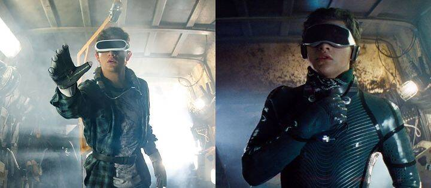
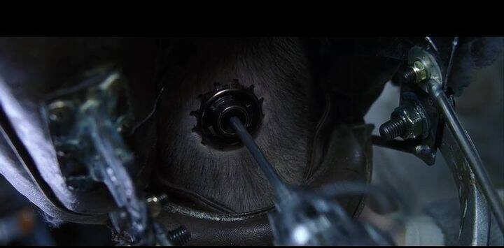

# 元宇宙（Metaverse）的关键技术挑战和机会有哪些？

元宇宙（Metaverse）的理想和愿景很有吸引力，但完整的技术框架是什么样子？有哪些关键的技术挑战？哪些问题已有清晰的实现路径，哪些还根本没有？

从目前来看，我们不可能一下子就实现一个包罗万象，高度真实，能让我们生活其中的元宇宙。而更可能的是，有一定的元宇宙雏形各种场景先行发展，在各种技术尝试达到一定程度之后再逐渐向最终形态发展。对于不同的场景，可能依赖的关键技术差异很大。因此，在讨论技术挑战之前，需要我们先明确目标的应用场景，以及其需求。先来个抛砖引玉。

以下为原答案对于Metaverse或者其它名字的虚拟世界，有各种科幻小说的描述，电影Matrix和头号玩家和很多动漫作品也已经做了很形象化的展示。但怎么实现这样的虚拟世界，技术上有很多值得探讨的地方。有些问题，可能是需要现有技术扩大规模，这类问题还比较好判断；也有一些问题现在的技术如果没有阶跃性发展，似乎是无解的。Metaverse需要大量的创新，包括内容生成，经济模式，交互方式等等。我主要关心的底层软硬件技术。Metaverse的发展肯定有个渐进的过程，也会有不同的内容和形式，技术挑战最大的是高度沉浸式的。这类Metaverse的终极目标也许是“自己都无法分辨是在模拟世界还是现实世界”。首先是”人“这一侧，主要是如何接入Meatverse的问题。

现在的VR/AR/MR一定程度上试图解决把虚拟世界”展示“给我们的问题。先不说效果如何，这个接口的也只能提供视觉和听觉信息。虽然视觉和听觉为我们提供了大部分信息量，但其它感知能力，触觉，嗅觉，味觉也虚拟世界能让我们有真实感的关键。另一个交互的方向就是向虚拟世界输入的问题，语音，手势，动作等等。几年前我的几个朋友做了数据手套，采集手势。应该说准确度还说得过去，但应用还是有很多问题，包括习惯，毕竟我们和现实世界交互并不用专门戴个手套。现在有一些基于机器视觉的手势，姿势识别，但也有很多现实的问题，比如视野范围和遮挡的问题。即使这些输入技术进一步组合发展达到实用效果，我们还是会发现更难的是前面提到的触觉反馈之类的问题。

如何让我们的手和身体能够感受到虚拟世界里的物体，似乎是个无解的问题。虽然有一些研究能够提供有限的力反馈之类的功能，但感觉这些探索很难有质的提升；即使能有一定的进展，总不能我们全身都穿上力反馈的服装吧？下图来自头号玩家，可能可以更好的说明问题，至少需要VR眼镜和手套，高配就是全身装备。即使大家愿意穿全身装备，能用这样一身服装实现全身体感的技术挑战还是很大的。

也许未来真正能够实现Metaverse体验的”人机“接口的唯一可行的方式是Matrix里面的”脑后插管“的方式？当然这样的侵入式接口要让大家接受就更困难了。不过也许直接和大脑相连，接管大脑和外部的接口是唯一实现“沉浸”的终极目标的方式。

目前的脑机接口尝试也挺热，不过还只能说是最初步的尝试，能走到何方还不清楚。然后是”云“（Metaverse的基础设施也许不叫这个名字）侧。似乎对云侧的分析要容易一点，毕竟不用在人脑袋上接一条线。云要解决的问题，最容易想到的是算力。这个看起来是可以大致估计的，对物理世界的模拟，场景的渲染，和其它人物（包括真实的人物和虚拟人物AI）的互动，等等。如果考虑总的算力，如果对应每个接入的人，需要的算力是C，如果有N个用户接入，整体算力是应该是多少？模拟一个行星级的世界，是否需要行星级算力以及超过行星级的能量能呢？可能未来最大的障碍是“模拟和渲染”一个“真实”的世界所消耗的能量的问题，大型数据中心配核电站也未必是解决之道。另一方面，一个用户的算力需求，也有很大差别。

节省资源的模拟当然是只计算你能“看到”的范围内的“世界”。最简单的情况是你只和身边的小范围世界交互，但如果你拿起望远镜，又或者是坐着宇宙飞船探索宇宙怎么办？所以，从每个用户看，算力需求变化很大，所以Metaverse的整个算力架构应该是高度弹性化。虽然弹性是云计算的重要特征，但能做到Metaverse要求的弹性不一定是现在这个软硬件架构自然发展能够企及的。还有一个问题的是时延，从接收到用户的输入到给用户输出他周围的世界，不能有可察觉的时延。所以对Metaverse基础设计的要求，既要有”行星级“算力，还要有巨大的弹性和很小的时延。目前的技术演进应该是解决不了的。

在人和云之间是不是还会有个中间设备，比如今天的手机？有这个中间设备的话是让问题简单了还是更复杂了？不好说，感觉是会更复杂。如果能把大脑直接连到server，很多技术问题应该能得到简化。接入Metaverse的话，可能还是直接在脑袋后面接根光纤到server的体验最好（少佐不也是吗）。以上算是闲聊吧，有说的不对的还请大家指正。回到我的问题，我初衷是希望这个Metaverse大目标可以牵引更多的技术思考，讨论和创新。我们的有生之年不一定会能看到Metaverse的实现，不过沿途能够看到或者参与到构建它的过程也是很有意思的。
