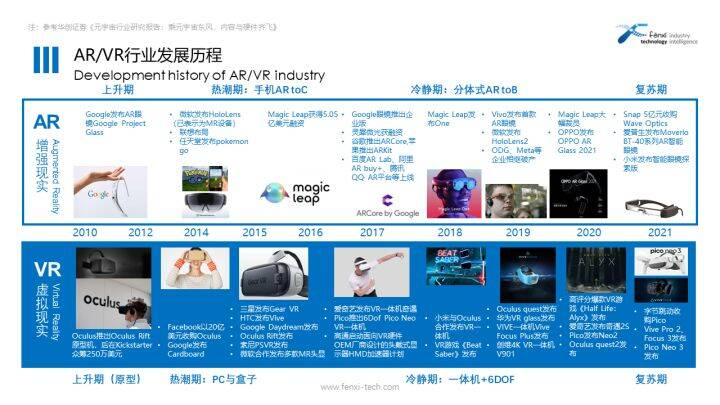
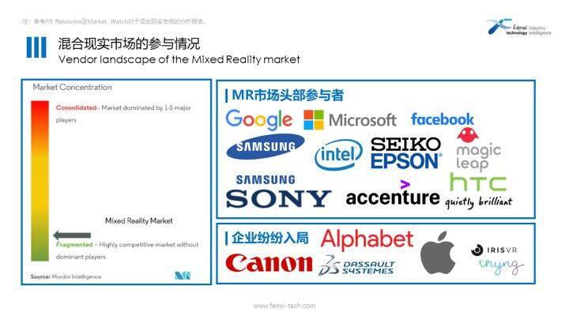
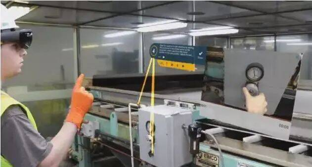
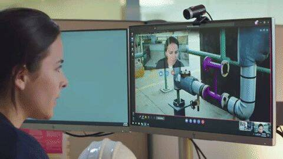
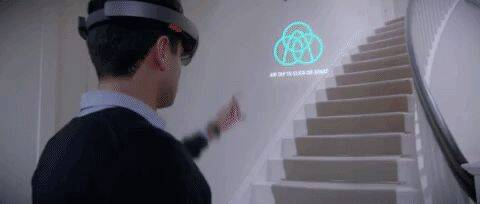

# 工业元宇宙系列：混合现实如何助力工业领域

> *人类正在由工业文明社会末期的信息化社会向信息文明社会过渡，如何解决未来社会中的人、社会与物理空间、信息空间的关系，虚拟现实、增强现实技术提供了重要的技术支撑。
> *余文江*
> *中国虚拟现实及可视化技术联盟秘书长*

## 一、何为混合现实

“XR（Extended Reality，扩展现实，包括了AR/VR/MR技术）是不是数字化时代唯一的‘元宇宙’入口或未来信息化的唯一硬件，这一点不好说！但XR很可能是未来元宇宙和未来信息化的‘规模最大、占比最高’的硬件！”业内人士指出，XR前途无量。特别是随着元宇宙为中心的内容平台和内容自身的大力发展，XR正在进入“硬件进步与应用进步相互正向激励”的发展新阶段。

在XR技术中，AR/VR大抵更广为人知，行业均经历多年发展，持续迭代下硬件成熟度迎来较大提升。下图简单展示了AR/VR行业的发展历程。

图;AR/VR行业发展历程

微软推出Holo Lens伊始，很多人说:“好酷的VR头盔!”这时有专家说:“其实它是AR。”但微软明确表示,Holo Lens是一款MR设备。MR混合现实是指真实世界与虚拟数字世界相结合产生的一种新的环境可视化方式，技术上涉及虚拟现实和增强现实。也有人简单比喻AR/VR/MR的关系为，AR/VR是冰、水，MR是冰水混合物。MR对于工业企业的价值十分显著，例如数字设计评审，行为数据看板，零售空间优化，技能远程指导等等。

二、**混合现实市场当前发展情况**

据美通社（PR Newswire）报导，到 2028 年，全球混合现实市场规模预计将从 2021 年的 3.31 亿美元达到 24.83 亿美元，2022-2028 年的复合年增长率为 28.7%。由于设备的初始成本一直处于较高的价位，C端普通消费者难以承受，然而对于企业而言相对合理。

MR市场集中度高，主要参与者包括Google、Intel、Seiko Epson、Microsoft 、Samsung、Facebook、Accenture PLC、Sony、Magic leap、HTC等。然而，也有Thyng 和 IrisVR 等较小型的供应商通过提供具有竞争力的价格和定制产品的解决方案，在全球市场上与他们竞争。

全球混合现实市场的参与情况

目前，建筑工程产业占据了MR行业的主要份额，当前的应用范围从 3D 建模和虚拟成型到远程维修指导和项目监控应用程序。例如，一些启用了 Microsoft Dynamics 的企业正在使用 Microsoft HoloLens 来帮助用户。在需要过程可视化（包括装配过程）的场景中，混合现实也是一种有用且强大的工具。在炼油厂的实际运营过程中，经常有员工不理会指导和学习手册的情况，而通过对应场景的应用程序，混合现实能够教导培训员工正确的工作方法、手法。

各种应用程序开发人员和硬件开发人员正在投资开发兼容 MR 的产品。例如，zSpace在 2018 年 12 月发布了一款针对教育工作者、学生和医疗保健提供者的笔记本电脑。这款电脑通过专门的 3D 屏幕技术和轻巧的眼镜，结合AR/VR技术，使MR内容更易于访问。Google Chrome2021年也透露正在着手兼容Windows混合现实头显。目前，谷歌Chrome通过谷歌的WebVR项目已经在Windows上支持Oculus Rift等虚拟现实头显近两年了，但是HoloLens的兼容性依然有待开发。

## 三、**混合现实如何作用于工业**

工业MR可穿戴设备的开发和创新步伐迅速，尤其是在制造和培训方面。可靠的投资回报以及重大的技术和用户利益使可穿戴设备（例如HoloLens 2）成为企业有吸引力的投资。

*注：下方HoloLens的3则应用案例引用自@三次方AIRX：《万字干货盘点HoloLens应用场景（上）》*

> **HoloLens帮助污水处理厂员工培训**
> 西雅图地区的 King County与微软和当地的科技初创公司Taqtile合作，启动了一个项目，为西雅图西点污水处理厂的员工提供培训。King County的CIO Tanya Hannah说:“通过使用MR眼镜来培训工厂操作员，可以带来更快、更好、更经济的效益，也可以更好地保护我们的环境。”

图：污水处理厂员工利用HoloLens培训

> **HoloLens实现雪佛龙远程协助应用**
> 远程协助一直是HoloLens最具有优势的应用。远程协助使用户（尤其是前线工作人员）能够与远程专家共享他们的观点，远程专家可以注释其观点，共享文件和图像并指导他们完成工作流程。在安全方面，该应用程序还提供Azure Active Directory和移动设备管理支持。

图：远程专家通过HoloLens协作

> “通过在全球部署HoloLens，雪佛龙已经取得了真实的、可衡量的成果，”微软负责商业应用和工业的副总裁Alysa Taylor写道。
> **HoloLens协助电梯安装**
> 微软宣布了HoloLens与thyssenkrupp建立合作伙伴关系。安装电梯很有挑战性，因为每个家庭的楼梯都是独一无二的，没有一种适合所有人的电梯。每个楼梯升降梯都必须针对每个单独的楼梯进行定制，因此测量、制造和安装需要相当多的时间。使用HoloLens可以使这些步骤更有效。

图：HoloLens执行数字数据捕获测量楼梯的步骤，并保持记录这些数据

> 楼梯数据被实时上传到云上，这样生产现场就可以访问，楼梯升降机上的生产可以立即开始。thyssenkrupp产品生命周期管理主管Simon Feismann评论称，将HoloLens整合到生产中，可以使生产过程比以前快4倍。还可以选择通过HoloLens提供的动画向客户展示楼梯电梯的预览。

我们再以Rokid MR设备为例，为方便开发者进行行业应用开发，Rokid Glass搭载 Android N系统，4G 内存，64G 存储，可自定义安装各种开发工具包，可广泛应用于室内外导航、线下购物、社交、远程协助、旅游、展览、教育、工业 4.0 等行业及场合。

总体来说，依托MR技术，**可以实现3D课件快速编辑，真实设备与虚拟3D内容操作指导对应，新员工可按照MR指导完成工作，同时还可以为企业提供仿真培训的评估及反馈系统**。通过员工的实际操作进行考核系统管理，在一定程度上保证员工的事实可操作性，减少计划外的成本流失。

对于远程设备维修，MR技术可以**通过提供数据导入、机器学习和可视化的解决方案，实现跨领域数据访问对接新的流程编排，获得更易于操作的用户体验**，最终得到更快的服务响应速度，更高的一次修复率，也可帮助企业规范化员工操作步骤，大大节省企业时间和资金成本。

相较于传统IIoT工业物联网实时数据，扩展的MR智能制造方案可以通过融合数字物理，打通全生命周期、全价值链信息孤岛，实现产线数字化映射，更综合分析优化的目的。

## 四、结语

将真实世界投射至虚拟，再通过虚拟世界的操作来作用于真实，依靠MR技术作为底层技术，辅以工业互联网、人工智能、区块链、5G等技术，甚至那些在当前并不广为人知的新兴技术，相信工业元宇宙能够真正作用于产业指日可待。

目前而言，MR技术已具有一定应用发展但仍有较大的局限性，且行业头部的企业、产品也受到一些争议与质疑，然而目前已实现的一些应用场景探索和实践就已振奋人心。目前MR领域不乏平台、设备、软件生态方面的投资，这些投资的最终目的是将现在习以为常的工具转换成全新的沟通和协作范式，从根本上改变未来。

MR通过结合数字和物理现实，整合AR/VR和物联网技术，将智能物理、重力、尺寸甚至私人化需求等数字内容添加到我们相应周围空间上，进而模糊真实和想象之间的界限，让我们见识到从未经历过的场景。这不是科幻小说，而是未来。
