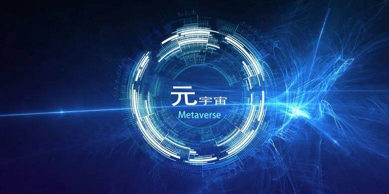

# 元宇宙基本场景的实现大概需要10-20年

互联网发展至今，“数字化”概念早已深入人心。在数字化进程中，数字经济概念逐步形成，并成为引领全球经济发展的重要引擎。

在以物联网、人工智能、5G、区块链为代表的新兴技术推动下，新一轮科技革命和产业变革不断向纵深发展，传统产业加速改造升级，新理念、新业态、新模式全面融入各领域与全过程。与此同时，以“元宇宙”为代表的新一波互联网红利，借助科技与未来概念进入大众视野，并激发出前所未有的市场热情。

**| 加速向传统产业渗透，数字经济仍临三大挑战**

传统产业在数字经济的渗透下，正在经历全方位、全角度、全链条的改造，这取决于信息技术对于产业发展的重要性和必要性。左鹏飞表示，信息技术已经成为决定产业现代化的关键因素，其必要性和重要性主要体现在 “引发技术奇点，带动产业跃迁式升级”“应用效果好，推动产业持续提质增效”“融合创新性强，推动产业跨界融合”“优化资源配置方式，助力形成平台型经济组织” 等四个方面。对于传统产业来说，数字经济是产业运行的重构者、产业效率的提升者以及产业创新的增强者。

左鹏飞表示，当前数字经济发展主要面临三个方面的挑战：一是关键核心数字技术不强 ，目前我国在高端芯片、操作系统、核心元器件等关键核心数字技术领域，仍存在受制于人的风险；二是数字经济渗透率不高 ，数字经济在传统产业链上下游延伸和整合的水平仍有待提高，尤其是工业和农业领域；三是平台经济局部发展不规范 ，平台经济是数字经济的重要组成部分，目前平台经济总体发展态势较好，但是部分平台企业发展存在不规范、不合理的经营行为。

**| 未来10—20年，元宇宙基本场景或将实现**

作为现实物理世界的延伸与拓展，元宇宙风头正劲。对此左鹏飞表示，元宇宙的发展符合互联网演进的方向。投资机构纷纷押注元宇宙，则进一步推升了元宇宙的热度，激发了虚拟现实、人工智能、区块链等高科技行业的创新创业热情，也一定程度上增加了元宇宙产业泡沫。同时，元宇宙的发展需要面临包括，因数据体量与数据收集维度导致的 数据安全挑战，因数字基础设施建设形成的 垄断基因挑战以及 虚拟世界与现实世界之间的正向互动挑战 等三方面挑战。

当然，在面临挑战的同时，发展元宇宙同样也将带来不少机遇，包括在 技术创新、产业升级、文创产业融合、非接触经济以及智慧城市等多个方面。不过，受限于当前算力条件、网络技术与虚拟现实技术的发展，左鹏飞表示， 元宇宙基本场景的实现大概需要10—20年 。同时，他还提到，我国在发展元宇宙方面存在用户规模、创新经验以及政策支持等多项优势，但若想要产业健康发展仍然需要从技术、标准、法律等方面进行布局。

**| 区块链加速数据要素化，分布式存储或成主流**

数字经济的蓬勃发展，促使数据成为重要的生产要素与元宇宙时代的重要资产，在这之下区块链技术起到了支撑作用。左鹏飞表示， 区块链技术与以往其他信息技术有着很大的不同，它不仅影响生产力，而且直接影响生产关系 。通过智能合约形成共识，区块链可实现点对点的价值传递，对金融、支付、信用、物流、能源等多个行业进行改造升级，提升产业发展水平。同时， 区块链推动传统组织形态发生转变，去中心化的分布信任关系，以一种可量化的价值网络改变传统生产关系，可以推动更精细化、模块化、规模化的行业分工，实现超大规模的产业协作 。而区块链分布式存储在驱动用户存储空间分享、增强大数据在线处理能力与存储安全性和隐私性方面的优势或将成为未来主要的存储模式。

在数字经济快速发展的当下，数据同时满足“现实性”“可控性”和“经济性”等资产原则，即数据可以作为资产存在于当前经济活动中。同时， 作为市场主体独一无二的竞争优势和核心资产，数据是大势所趋、是发展刚需 。左鹏飞表示，作为一种在数字经济时代产生的新技术， 区块链强化了数据作为生产要素的作用和价值 。一方面， 区块链具有存证作用，可以记录数据的状态，并明确数据的有效控制者，助力数据要素确权，进而推动数据定价 ，有效解决数据要素定价难的问题；另一方面， 点对点协商定价进行交易，与区块链的点对点价值传递，具有一种天然契合性，可以成为数据要素市场的组织工具 ，有效解决数据要素在市场上进行大规模交易的难题。这些都将有效推动数字资源成为生产要素。
