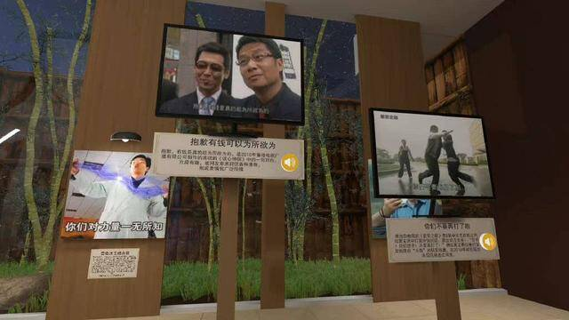
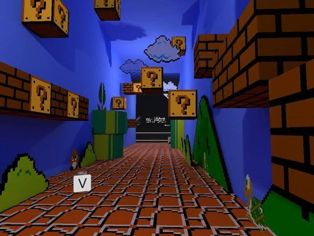
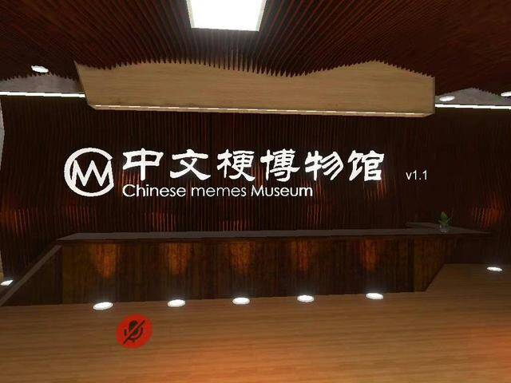

# 国内最佳元宇宙项目？元宇宙项目“中文梗博物馆”正式开馆！

近日，被称为国内最佳的元宇宙项目上线啦！“中文梗博物馆”正式开馆，这个依托于线上虚拟现实社区VRChat所建造的博物馆，展示了2000年至今的数百个网络流行梗，互联网在中国20余年的记忆，就被浓缩在这一方天地之中。不少网友参观后，还将此评价为“国内最佳元宇宙项目”。

▲ “中文梗博物馆”馆内

**为“梗”造博物馆—— “7个展厅浓缩20年中文互联网记忆”**

“网红小胖”“我和我的小伙伴们都惊呆了”“杀马特”“贾君鹏你妈妈喊你回家吃饭”“不要迷恋哥，哥只是个传说”……

走进“中文梗博物馆”，在第一个展厅“梗起”中，也许就能体会到什么叫做“死去的回忆突然开始攻击我”。在这个展馆里，集中展示着21世纪初，也就是2000年前后中文互联网刚刚兴起时所流行的“梗”。细看之下，就能发现这一批梗年代久远，且大多出自贴吧、论坛等国内最早一批的社交平台，当网友们看到这些年代感十足的网络图片、表情包时，恐怕也得喊出那一声：“爷青回。”在那个网络还不是十分发达的年代，这些“梗”曾带给了最早一批“冲浪选手”们单纯的快乐。

▲ “中文梗博物馆”馆内

而沿着展厅一路走去，还将依次经过“梗承”“梗兴”“梗繁”“玩家”“二次元”“家”展厅，一共七个展厅中，沿着20年中文互联网梗的时间线索排布，里面包含了从千禧年至今的共200多个网络梗。其中，既有“杀马特”“网红小胖”等这些“古早”的网络流行词，也有最近被人们疯抢的“可达鸭”，被频繁使用的“退！退！退！”等正新鲜的网络梗。

“我是一个B站的深度用户，经过我十多年上B站发现，至少对于社区来说，以各种流行的梗为中心进行的创作，都是很受欢迎的。同一个梗，它被不同的方式进行二次创作和改编，反复让人觉得快乐和有趣。”

谈起“中文梗博物馆”的缘起，馆长以及创建者VP主四迹解释了最开始想要做这个博物馆的原因。其实，在过去的20多年来，依托于网络诞生的新奇事物数不胜数，但他选择了运用“梗”这一事物来打造博物馆，自然是经过了许久的考量。“而且围绕梗的相关内容很多，人们聊天的话题，往往也绕不开热门梗。再加上我个人也比较喜欢，觉得‘梗’是一个比较好的选题，于是有了‘中文梗博物馆’的诞生。”

说起来似乎直白简单，但是要从浩如烟海的“网络梗”中，选出能够进入博物馆的内容，并且要分门别类，符合不同展厅的主题，且有展品的“梗”就达到了上百个，其中的工作量不言而喻。再来，用2个多月打造出一个虚拟的博物馆，对于四迹来说，是一个大胆且没有前路可以借鉴的尝试。在准备“中文梗博物馆”的过程中，他感觉像是“进度条被拉满了”，每天做的事情几乎就围绕着这个博物馆展开。

“一开始，‘梗’都是我自己在网络上收集，后来也会有一些网友和朋友的建议。任何时候看到合适的梗，我都会记录在我的表格之中。一共收集了300多个‘梗’，但最终进入博物馆的，应该是200多个。”四迹说到，选择“梗”的标准，自然是要积极的、正面的，并且有大众知名度的，过于小众圈层的“梗”并不适合放到馆中展示。“当然，如果这个‘梗’能构成一个有趣的模型来展示，或者能够引起观者的某些思考，哪怕不那么热门，也能进入展馆之中。”

**还原名场面——“打造现实博物馆难以达到的体验”**

介绍了中文互联网最早期的一些经典梗的展厅“梗起”；展示在互联网逐渐发展起来后，通过网络视频平台所诞生出的新梗的“梗承”；呈现更加贴近当下人们所处时代的互联网名梗的展区“梗兴”；展出一些动画作品中名场面、名台词，承载了无数二次元爱好者回忆的展厅“二次元”；进入展区就好像来到了经典游戏场景之中的“玩家”展厅……

在四迹设计的整个展馆中，既能看到按照时间顺序梳理了20年来的中文流行“梗”，还能发现观众特别设置的“二次元”“玩家”展区，展示了依托网络发展所诞生繁盛的事物和圈层。

值得一提的是，倘若说前面的展区，因为网络刚刚开始普及，“梗”的诞生大多依托于文字和图片。那到了后期，网络视频平台的兴起、短视频的流程，让“梗”的出现集中在了一些综艺、电视剧等影视作品中。

而为了让展陈的方式更加多元和趣味，四迹还采用了独特的名场面重现方式，来向参观者介绍“梗”诞生的故事。譬如，馆中全景式还原了《中国梦之声》的舞台，作为B站鬼畜常客的“波澜哥”“面筋哥”等，均是出自此档节目。此外，和该场景一样被全景式还原的“名场面”，还有“杰哥不要”“鸡汤来咯”等等。

“做这个博物馆，我肯定是尽可能地去表现一些现实博物馆难以实现的地方。”四迹说到，在设计的过程中，既要让观众有真正在逛博物馆的体验，但又想突出虚拟博物馆的优势，让观众得到独特的参观体验。所以要反复调整动线、馆陈方式，包括馆中展示文字的大小，行走的方向都经过了不断地尝试。“没有哪个地方是不艰苦的。比如《中国梦之声》的舞台，动线确定好了之后，还要解决射灯的效果、地面的反光、颜色的还原、大屏幕的动态等问题，都要一个一个解决。”

▲ 馆内还原的《中国梦之声》舞台

此外，在“玩家”的展厅中，还能看到四迹的独特想象力所带给参观者的惊喜。在“马里奥的转场”这一环节中，参观者可以从《超级马里奥》游戏中的管道跳下去，直达到这个游戏风格的走廊中，就像穿越到了游戏的世界。同时在依托游戏《我的世界》所创造的沙盘中，如果参观者走过旁边的一道传送门，就会自动穿越到这块沙盘当中，变成缩小版的自己，感受瞬间比例缩小的趣味。而这些，都是在现实博物馆中，难以达到的体验，也是四迹极为满意的部分。

▲ 《超级马里奥》游戏体验

**带来快乐之外——“思考元宇宙产品更有意义的发展方向”**

“这不只是想要给你带来不一样的快乐，回忆、总结、分享互联网梗文化。更重要的是对未来互联网内容消费模式的一次探索，与可能的启发。重新思考众说纷纭的元宇宙产品更合理更有意义的发展方向。”

在“中文梗博物馆”的序厅之中，四迹曾写下这样一段话，将创作这个博物馆背后想要表达的意义蕴含其中。在时代的浪潮中，这些“梗”突然爆红，被数以千万的网友所转载、使用，之后又迅速被人们遗忘在岁月的尘埃中。采访时，四迹也说到在收集这些网络梗的过程中，也感受到了其所折射出的时代审美、社会发展的变化。

“我觉得‘梗’，是一个被动存在的东西，它是突然会让一些人感到快乐或者情绪波动的内容，然后被广大的人群认可。这种被动的东西，也能折射群体大致的精神状态，或者说价值趋向的变化，审美趋向的变化。”

四迹回忆，早期的网络梗依托于文字、图片，后来出现了网络视频后，鬼畜视频开始流行，再到智能手机普及之后，短视频传播的效率变高。网络发展不断加快下，“梗”的更新迭代也越来越快，持续爆红的时间缩短，也就更加转瞬即逝。“可能最早的时候‘神马都是浮云’，现在看来挺无聊的内容，却能在那个年代都爆火。现在能火的‘梗’往往节奏感很强，画面很刺激，让人特别想笑或者让人觉得情绪突然放大的东西。”

而四迹也说到，自己创作“中文梗博物馆”的目的，也是希望让不同的人看到能有不同的感受，且越多越好。同时，也希望馆中封存的网络记忆，能够让游客触发一些他们曾经的际遇。“这些‘梗’的共通点，可以说中国的网民都在追求快乐，都是积极乐观的人群。”

▲ “中文梗博物馆”馆内

当然，如果想要用“梗”唤起大众对于网络的思考，对于时代的追忆，那也许写个盘点的文章，也能将这些“网络梗”包含其中。可四迹选用在网络虚拟世界打造博物馆的方式，耗费2个多月的心血来创造出观众的一墙一砖，自然还有着更为庞大的野心。就如在展厅中所写到的那样，他渴望用这座博物馆，来表达他对于“元宇宙”这一概念的想法。

“我是认可我自己做的方向，是元宇宙；这个概念产品所发展的一个方向。至少觉得我做这个东西，它是有用的，有用户体验的，能被用户认可的，甚至很多用户觉得它新鲜。他们愿意相信这个东西定义为是元宇宙的一个产品，我觉得是很难得的。”

目前，“中文梗博物馆”的参观人数已经达到了10万，在游戏之外，还有更多网友是通过视频认识到这座博物馆。在网络中，曾有网友评价该馆，是“国内最贴近元宇宙体验的真实成品，是中文互联网元宇宙的首次成功应用”。这一评价，也让四迹记忆深刻。他说到，自己也无法定义这个博物馆到底是不是“元宇宙”，但如果能有更多的玩家看了这个馆以后，去思考“元宇宙”到底是什么样子，又该往怎样的方向去发展，那四迹的目的，就已经达到了。
