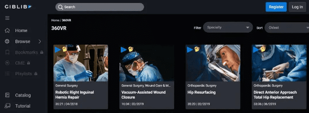
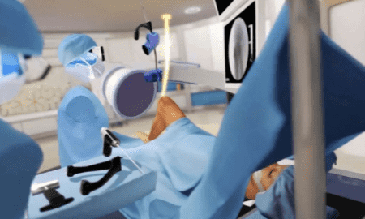
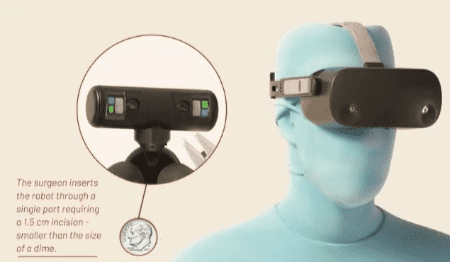

# 虚拟现实、数字孪生……医疗元宇宙场景有哪些应用？

从去年下半年宣布进军元宇宙（Metaverse）业务，并将母公司从Facebook更名为Meta Platforms以来，扎克伯格凭一己之力让“元宇宙”这个已经存在于科幻小说里30年的概念在全网破圈。

海外，包括“元宇宙第一股”Roblox和全球芯片巨头英伟达在内的一些科技企业实际上早在扎克伯格前就已经着手布局元宇宙。近期，微软687亿美元收购暴雪也显示了在元宇宙分一杯羹的心思。而在扎克伯格宣布元宇宙动作之前和之后，国内也有一些科技巨头已经或决定进军元宇宙。腾讯投资了Roblox，字节跳动投资了游戏开发商代码乾坤和VR公司Pico，百度推出了元宇宙社交app希壤等等……

在热议的概念下，游戏行业被公认为是最具有元宇宙雏形的领域。尽管元宇宙在医疗领域的应用还不常见，但我们还是能够看到一些初创公司在朝元宇宙形态下的医疗健康行业采取行动。本文一起来看一看搭上元宇宙形态的医疗有可能是什么样子？动脉网希望借此抛砖引玉，为医疗健康领域更好的发展助一份力。

**医疗元宇宙的初级畅想**

仍旧没有一个公认的描述能够用来定义元宇宙。Metaverse一词首先出现在美国科幻小说家Neal Stephenson在1992年出版的小说《雪崩》中，是一个基于虚拟现实的下一代互联网。在扎克伯格的愿景中，元宇宙能改变人与技术之间的关系，允许用户在虚拟内容中完成或与虚拟内容一同发生体验，而不是简单地与数字产品和解决方案进行交互。

接下来让我们尝试想象一下医疗健康背景下的元宇宙。目前，以互联网技术赋能的医疗行业，其产品和解决方案使患者和医疗提供者能够查看、共享、交换、创建或以其他方式与数字内容进行交互，如将患者数据输入电子病历系统、通过在线门户发送付款信息、在应用程序上观看物理治疗演示或在远程医疗咨询期间共享视频。在元宇宙下，我们可以想象得到的医疗健康体验可能包括患者用VR方式参加团体治疗课程、外科医生通过全息解剖来规划手术步骤、孕妇通过AR技术练习母乳喂养技术。

目前人们对于元宇宙可能会涉及的元素有这样几个共识：扩展现实（包括VR、AR和混合现实MR）、3D图像技术、人工智能、区块链和加密技术，甚至是脑机交互。美国数字健康基金Rock Health认为，元宇宙中的医疗保健存在广泛的可能性，但目前有两大类应用场景和尝试最为常见：

**1.沉浸式环境：通过扩展现实创造的虚拟世界，医疗保健的提供者和消费者出于医疗教育、辅助或治疗目的参与其中**

**2.数字孪生：现实世界的实体在虚拟世界中的映射，可以被用来协助进行医疗保健的相关决策**

根据Rock Health的统计，2021年整合了VR或AR技术的数字健康初创公司在11起交易中拿到了1.98亿美元的投融资，是2020年9300万投融资的两倍多。尽管2021年的投融资还不到整个数字健康赛道的1%，但市场和资本都在释放对于元宇宙的早期关注信号。另外根据动脉网的不完全统计，国内约有21家涉足VR/AR+医疗的初创企业，在2019年以来获得投融资的有6家，共计融资额1.31亿元人民币。

**元宇宙+医疗可以有哪些场景应用**

围绕以上两个维度，动脉网扩展了相关领域和场景，搜罗了以下海外数字健康的产品形态，它们或许就是医疗健康领域走向元宇宙的初始阶段。

**1、医疗教学培训虚拟化**

**● 数字医学图书馆**

2013年6月30日，美国医生外科医生Rafael Grossmann完成了首个佩戴谷歌眼镜进行的手术。他曾表示，在看到谷歌眼镜的第一刻，就意识到了可穿戴设备能为医疗行业带来的颠覆性创新。对于这场手术，Grossmann进行了“直播”，学生们不再需要围绕在医生身边来观摩手术从而进行学习，而是可以在一定距离外，以精准的医生的第一视角看到、听到手术室里发生的一切，并实时提出问题、得到回复。

这为外科教育打开了新的方向。传统上来说，对于医学生和执业医师的外科教育很大程度上取决于他们能否进入手术室，以便从顶级专家那里学到新的手术技术，然而这一机会通常十分有限。VR技术的应用，为医学教育带来完全不同的体验。在这点上，医疗教育流媒体视频库GIBLIB是一类。

GIBLIB提供丰富的4K高清视频资源，内容包括医学教学、讲座和会议内容、手术操作，被称为医学教育界的Netflix。GIBLIB将真实的手术以4K、360度VR的形式录制成视频，实现外科医生视角的精确摄像机角度和360度全景，用户只需要戴上VR设备就能够以沉浸式的方式观看手术室中的真实活动。GIBLIB还向外科医生和医疗专业人员提供360度VR形式的继续医学教育 (CME)认证内容。

CME认证指的是帮助医疗执业人员保持并提高其自身专业技能、知识和竞争力的教育活动，在美国一些州，这是许多医疗人士保持自身执业资格的必要条件。有时候，医疗人士甚至需要前往世界各地的一些医学会议来获得相关认证，对时间、金钱、和地点都提出了更高的要求。GIBLIB的在线视频库则意味着人们使用手机和电脑就可以通过沉浸式的方式进行学习。

*GIBLIB官网*

**● 手术培训平台Osso VR**

同样是利用VR实现教学培训目标，Osso VR打造的是另一种模式。它和GIBLIB那样将真实拍摄的视频传入VR设备不同，而是通过高度逼真的视觉技术，为处于VR环境中的实习医生、外科医生和医疗器械专家等人士再现一个手术室场景，让用户通过VR遥控装置，在虚拟环境中锻炼各类手术的实际操作。Osso的平台提供了卓越的视觉保真度，确保从解剖细节到手术室环境的各个方面都如现实一般。

*Osso VR官网示例截图*

Osso的创始人、Justin Barad曾是一名骨科外科医生和软件开发者，他在历经手术室的多年考验后创立了Osso VR。他曾表示：“新型医疗器械层出不穷，而我们真的曾在病人已上手术台的情况下用谷歌搜索使用方法。学习曲线数据表明，你必须操作100次才能熟练掌握一项新手术。所以出于安全考虑，我们通常不会使用新器械，因为我们没有时间去充分学习所有内容。”

传统的培训方法限制了外科医生们掌握技术和新的医疗器械的速度，同时缺乏手术操作表现的客观反馈和衡量的有效途径。有了Osso VR，医生们就可以随时随地为自己安排近乎真实的手术和器械的操作练习。Osso 还可以对医生的模拟训练精确度进行分析，跟踪训练表现，并允许全球用户远程加入到协作训练中。美国加州大学洛杉矶分校David Geffen医学院的一项研究表示，与传统培训方法相比，Osso VR将参与者的手术表现提高了230%。目前，强生、史赛克和施乐辉等骨科巨头都选择Osso VR作为VR 培训伙伴进行了合作。

根据动脉网的不完全统计，医疗教学和手术实训平台及系统也是国内VR/AR医疗企业涉足最多的场景之一，涵盖产科、中医针灸和胚胎移植等学科，如域圆科技、昱然智能、智触计算机、医微讯、众绘科技、立方幻境和触幻科技。

**2、当手术机器人遇见VR**

有关机器人辅助外科手术的首次记录发生在1985年，当时PUMA 560机器人手术臂被用于精细的神经外科活检。两年后，第一个涉及机器人系统的腹腔镜手术，即胆囊切除术出现。到了2000年，达芬奇手术机器人成为首个得到FDA批准的用于普通腹腔镜手术的手术机器人系统，从此为机器人手术开辟了新的天地。手术机器人因为切口更小、精度更高、操作更加灵活等特点在今天得到了医生们更广泛的认可和普遍使用，也同样具有广大的市场渗透空间。那么，当手术机器人碰上VR，会成为下一代手术机器人的发展方向吗？

成立于2014年的Vicarious Surgical正在开发将类人机械臂与虚拟现实技术相结合的手术机器人，允许外科医生进行360度的可视化访问。Vicarious Surgical首先围绕手术机器人进行了改良，其机械臂只需要通过一个1.5 厘米甚至更小的切口就可以进入腹腔，并可以在各个方向上自由移动。

同时机器人的每条手臂拥有28个传感器，能够测量手术机器人的力量、行动、定位，做到完全复刻外科医生从肩部、肘部再到手腕的自然运动，做到让手术精度、视觉影像和控制都实现最大化。外科医生通过佩戴VR眼镜、操纵手柄，就可以感受到360度全景般的逼真感，仿佛直接进入了患者腹腔的感觉。

*Vicarious Surgical官网示例截图*

值得注意的是，Vicarious Surgical的手术机器人目前只获得了FDA突破性设备的认定，还没有完成最终的上市，VR设备也不会出现在第一代产品中。手术机器人+VR的畅想能否被外科医生普遍接受，尤未可知。

**3、增强现实辅助手术**

与VR辅助外科手术相比，AR技术的应用或许更加实际和可行。在介入手术中，外科医生通常需要借助术中X线，CT和手术导航系统帮助确定手术的走向，并需要抬头在另外一块屏幕上查看影像结果。在AR设备的帮助下，患者的导航影像和人体结构都可以直接在医生眼前形成实时投影，既帮助医生更加关注于手术和患者本身，对手术器械在病人哪个解剖位置、下一步应该如何进行等判断更加一目了然，还可以降低医生和患者受辐射照射的风险。

Augmedics的Xvision Spine System（XSV）是首个获得FDA批准的可以用在手术中的AR导航系统。医生戴上AR设备后，就可以直接在眼前清晰的看到患者的3D脊柱结构、手术器械和植入物的位置和走向，像是直接用眼睛为患者进行了CT扫描，并且避免了注意力的转移。XSV系统具备98.9%的经皮植入物放置精度。

在国内，维桌致远的全息影像系统、妙智科技的VR影像平台、还有霖晏医疗的AR骨科手术导航系统都是该场景下的代表。

**4、“沉浸式疗法”**

如果有哪个医学领域已经被证明了可以将VR用作治疗手段，那么VR赋能的心理健康、慢病疼痛这两个领域的数字疗法可以说已经为其他领域开了一个好头。

VR技术再造了3D环境，虚拟现实中进行的视觉、声音、甚至是感官交互，会让人们产生一种处于不同地点、时间、甚至是不同现实世界的感觉。通过构造这种沉浸式和交互式的环境，VR可以改变人们的注意力。过去30年的学术研究表明，这种注意力的改变在一些严重疾病的管理方面发挥重要作用，如疼痛和焦虑。

比如接受化疗或烧伤伤口护理的患者，沉浸式VR体验可以让治疗更容易进行，患者的痛苦感和对治疗时间的自我感知都会减小。在心理健康方面，虚拟现实也可以在缓解压力和焦虑方面起到作用。比如在治疗焦虑症、恐惧症以及创伤后应激障碍人群时，暴露治疗通常是一种重要手段。基于VR的暴露疗法为患者提供了沉浸在恐惧或焦虑环境中的机会，帮助心理治疗师更好地进行治疗。

对于这类疗法，慢性疼痛VR服务商AppliedVR更愿意称之为“沉浸式疗法”，其基于VR的下背部慢性疼痛产品EaseVRx，是FDA批准的首个虚拟现实疗法。在其他领域，Luminopia One通过VR进行的儿童弱视症治疗也得到了FDA的上市批准。BehaVR将冥想、暴露疗法、认知行为疗法等与VR、AR结合，提供焦虑管理、产后健康、疼痛管理等的治疗方案。TRIPP则通过VR和AR中的游戏，引导用户在沉浸式的环境中跟随声音频率和可视化的呼吸节奏进行练习，解决心理健康和情绪健康问题。

我国医疗创新企业也在利用VR和AR技术展开疾病治疗，如康复领域、视功能训练和心理健康治疗等，这类企业包括七鑫易维、诺亦腾、心景科技、双琦医疗、盖尔伦医学和颐康医疗。

**5、数字孪生（digital twins）**

除上述提到的利用VR/AR技术打造元宇宙形态的数字健康企业外，医疗元宇宙的另一大场景类别是数字孪生：这是现实世界的实体（器官、个人或患者群体）在虚拟世界中的映射，或者说是“双胞胎”，可以被用来服务医疗决策。数字孪生是合成数据的一种形式，一种利用人工智能获取的信息，它以真实实体为模型，并且通常以持续的方式与其现实世界的对应物相连。这种混合连接将数字孪生直接置于元宇宙中。

Siemens Healthineers 正在开拓心脏方面的数字双胞胎，一种反映个体患者心脏分子结构和生物学功能的复杂数字模拟。医生可以在做出任何现实世界的决定之前，模拟患者的心脏对药物、手术或导管干预的反应，提前测试各种治疗方案。Virtonomy构建了骨骼和肌肉群的数字双胞胎，以对植入物进行更好的设计，还可以模拟医疗设备或植入物如何随着时间的推移在患者体内降解。

除了器官，初创公司还在创造个体的全身数字双胞胎。Q Bio的Gemini平台可以通过人体全身扫描，获取患者的生命体征，扫描、病史和基因测试结果，从而创建整个患者解剖和生理学的复杂模拟，消费者可以将结果与专家、培训师、营养师和研究人员共享，以实现个性化护理。每当共享新的测试或扫描结果时，消费者的数字双胞胎也会得到相应更新。

AI远程医疗公司Babylon Health也在通过用户的健康数据，为他们建立专属的数字双胞胎，而Twin Health则开发了专注于开发新陈代谢领域的数字孪生，个人及其医疗提供者可以用它来规划有助于预防或逆转代谢类疾病的生活方式的改变。发布在美国糖尿病协会《糖尿病》期刊上的临床研究结果显示，Twin Health的数字孪生技术使92%的人不再需要使用糖尿病药物，超过90%的人实现了2型糖尿病的逆转。

Q Bio官网示例截图

既然数字孪生能够模拟个人健康数据和医疗情况，下一步，医疗和科研人员就可以将其用于模拟人群对疾病爆发或新药的反应，继而为元宇宙中的临床试验铺平道路。例如，Unlearn使用机器学习模型为临床试验的参与者构建数字双胞胎，将来他们的预后信息整合到随机对照试验中，不仅能加快试验入组速度、减少监测需要，还能保持严格的证据标准和研究的随机化和盲法。

**我们离实现医疗元宇宙还有多远？**

关于元宇宙，有人深信不疑，有人嗤之以鼻，有人对元宇宙的世界感到鼓舞，有人反对它的到来，还有人保持谨慎的关注。但毫无疑问的是，在我们真正选择拥抱（或者不拥抱）它之前，还有很多事情需要理顺。

首先就是定义——元宇宙代表了什么、它是否能成为现实、或者是否已经到来、谁拥有元宇宙，该怎么建设元宇宙等等。

作为元宇宙的拥趸，扎克伯格在与投资者的业绩电话会议中表示：“虽然我们的方向很明确，但我们前进的道路似乎并没有完全确定。”而年报显示，对于元宇宙的探索，已经让Meta元宇宙业务所在的“现实实验室”部门（与增强和虚拟现实相关的消费类硬件、软件和内容）的营业亏损在2021年超过100亿美元，收入为23亿美元。年报一出，Meta的股价径直下跌27%。空壳子下，投资人对扎克伯格的元宇宙梦保持警惕。

与模糊的概念相比，更显清晰的是元宇宙将会依赖的底层技术。能够肯定的是，不管有没有元宇宙的概念，VR/AR、人工智能、机器学习、计算机建模、3D影像等发展步伐只会加速前进。

从医疗领域看，这些前沿技术已经在助推精准医疗向前发展，如何把他们加减乘除进行组合做出更超前的产品，靠的是科学家和医疗人员的技术创新与想象力，而人类的想象从来都不应该被低估。FDA的CDRH中心也因为看到了采用扩展现实技术的医疗设备、疗法正日益增多，从而设立了扩展现现实医疗设备计划（MXR），为这类设备的监管进行研究，与快速进步的行业同步发展。专注于底层技术的突破和技术需求的匹配，会是接近医疗元宇宙最脚踏实地的方式。

第三，生态的建立。虽然当下还不存在有关元宇宙的统一共识，能够提早引领底层生态建设的一方，将在元宇宙的基础设施建设方面拥有话语权和市场空间。英伟达在2020年就已经推出了公测版的Omniverse（全宇宙），即“工程师的元宇宙”。工程师、设计师等在Omniverse上协作构建和交换3D资产和场景数据，进行虚拟世界的构建和渲染，并实现虚拟世界的进出。在公测版吸引了10万用户后，英伟达在去年11月宣布，Omniverse将向所有NVIDIA Studio的创作者免费开放。对标医疗领域，信息化企业也许最有可能成为元宇宙生态的建设者，并构建出一个符合医疗行业需求和数据特色的底层生态。

此外，还有医疗元宇宙的必要性、可及性和数据隐私等问题。医疗场景下的元宇宙或许可以为患者带来更精准、更高效的治疗方案，但这也意味着这类解决方案会向有扩展现实和互联网资源的人倾斜，有可能进一步加深医疗资源的不均衡。在更有性价比的方案和市场上更经济的软硬件面前，投资人、医疗人士、创业者、政策制定者等等恐怕都会问上一句是否有必要。如何对虚拟世界中交互的患者数据和隐私进行定义、监管和保护也值得深思。

科幻小说家恐怕是世界上最有先知力的未来主义者，但科学技术的不断创新才是让这种先知变为现实的媒介。没有元宇宙，可能还会有“园”宇宙，又或是“圆”宇宙，但它们都不会是科学创新的终点，因为科学创新，没有终点。第一群吃螃蟹的人，会受到质疑，相应的也会得到关注。走自己坚信的那条道路，是创新者的宿命。
