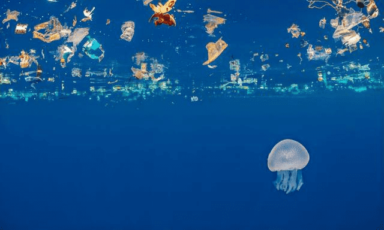
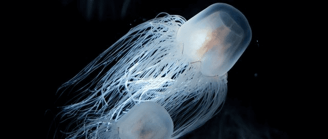

# 元宇宙场景x虚拟人：手把手教你制作虚拟人

在5月28日中信出版关于“元宇宙场景×虚拟人”主题沙龙的直播中，专家老师们总结了一系列设计关键词：国潮、时尚、酷炫、赛博朋克、科幻、运动、二次元、邻家、数字宇宙、穿越，而这些抽象的灵感关键词是怎样变成故事和形象的呢？

### 从环保概念衍生出的虚拟人

就在现在，有数百万吨塑料漂浮在世界海洋中。而我们每天丢弃的塑料大半会进入垃圾填埋场，多数需要一千年才能分解，而其中的毒素则会渗入水中和泥土中，给地球环境造成不可逆转的影响。为了让概念走出“真空”，本次大赛的特邀讲师——魏星老师，就通过“水滴星人”的角色设计提取了环境保护的概念，并为各位创作者梳理了从环保大概念到具体虚拟形象的步骤：

STEP 1: 背景调查

在“水滴星人”的生产过程中，魏老师首先以中国水域为蓝本，调查了塑料微粒、纤维从人类活动中产生，再流入生态环境，最后回到人类体内的过程和影响。

STEP 2: 角色设计

水滴星人以水母的形象为底稿，被设定为帮助地球人消除生态危害的外星人，可以更换不同的皮肤和材质。因为水滴星人生存的星球充满了水，来到地球后为了防止水分流失会一直穿着纸尿裤。

STEP 3: 平面设计

角色设定好之后，需通过平面制作使形象规范化，像水滴星人的头部、身上的触须等被做成平面版本的三视图（前、侧、后面）。

STEP 4: 延展

作者还会根据品牌形象和虚拟场景差异，在图形延展上为水滴星人设计不同的标识物或logo。

阿信小笔记：

魏星老师认为，虚拟形象的内核就是角色设计，所有的角色人物都是从角色设计产生的。角色可以代表一种社会现象或社会群体，是一个具像化的形象载体。角色设计是一个从无到有的过程，设计师把一个具体的角色抽象为概念，再通过视觉设计传达出来。

角色设计可应用在各个领域，如品牌设计、图像传播或动态影像，最终目的都是在情感上连接受众，引发宣传和传播效应。

### 从游戏里走出的虚拟形象

现下z世代、互联网原住民对游戏品类和多元化风格的需求，使游戏行业呈高走态势，有唯美风的、赛博朋克风的、中国风的等场景和虚拟形象设计。如今的游戏不只是为玩家提供娱乐方式，同时也结合当下时事，具备一定的文化底蕴。

林老师结合第四届“Ggac全球游戏动漫美术概念大赛”的主题——“元宇宙：ggac探索计划”，梳理了游戏动画里的虚拟形象和场景搭建的设计过程。

Step 1：创作背景

艺术作品可以是人类活动的印记。中国航天从神舟飞船、北斗卫星到天宫、嫦娥、天问，探索宇宙空间的脚步从未停止，元宇宙又可以作为我们探索世界的新纪元。所以，短片entropy. age选择了平行宇宙的概念，以虚拟航天人的视角站在地球以外的空间来回溯地球上发生的一切。

Step 2：作品主题

作者虚构了“熵门”的概念，把它理解成航天人踏入太空的一个转折点。全片仅设定一个以宇航员为原型的虚拟人，传达了航天人在宇宙空间孤身奋战，但仍然一往无前、勇于探索的精神。虚拟人在进入熵门之前，片子用较多的宇宙空间的镜头表现压抑的氛围，表现航天人在进入宇宙过程中的困境。进入熵门后，则突出表现了平行宇宙的概念，画面更偏向意识流，重构更为神秘、充满探索可能性的多元宇宙，也喻示我国航天事业的成功。

Step 3：作品设计

作者一共设计了22个场景，从剧本创作、模型资产、绘制贴图、搭建场景，最后剪辑合成一部短片。短片中搭建了未来元宇宙的场景，虚拟人不受时间空间的约束，自由穿梭在每个空间，场景中的物体和形状也可以随意变换。

阿信小笔记：

游戏场景的搭建为虚拟人生产内容提供了空间支持，为玩家打造一个具有情感温度的虚拟空间，激起他们的共情力，从而增加用户粘度。而游戏设计与文化、思想、社会热点的融合更能引起玩家的共鸣。

### 从月亮来的虚拟形象

在和月亮有关的人物中，最为被大众所熟知的莫过于嫦娥了。结合太空探索的科学概念，国内礼赠品行业首位虚拟人“嫦小月”，就在“神州13号”回归这个特殊的时间点，走进了大众视野。

作为“嫦小月”的项目负责人，罗媛静老师就在本次workshop中分享了三把让虚拟人通向广大市场的钥匙：

STEP 1:决定消费市场

品牌要赋予虚拟人鲜明的性格特征，才能针对不同的消费者制定不同的营销策略，也便于选择其他品牌进行深度合作。“嫦小月”具备自由穿梭虚实与古今之间的能力，这就形成了她与大众的认知差异，互动中会发生有趣的故事，产生奇妙的化学反应。

STEP 2:商业规划

基于虚拟人的人设和粉丝购买力，可以策划如短视频合作、数字藏品定制、商务代言、IP周边售卖、IP联名等商业化活动。

STEP 3: **场景打造**

虚拟人的应用场景要做到虚实相生，与虚拟人有关联的虚拟场景打造才易产生共鸣。适当搭配实景实物，与真人进行互动。比如“嫦小月”的原型虽然来自神话人物嫦娥，但她生活的地方却叫“不寒宫”，呼应了她“吟诗唱赋、喜欢分享日常生活”的贴近粉丝的人设。“嫦小月”也会出现在直播间与“大v”如历史类博主等进行互动，表现了虚拟人的特质和文化属性，使大众对虚拟人产生好奇心和探索欲。

阿信小笔记：

品牌虚拟人的每一次升级都是一次全新的蜕变，在保留经典印记的基础上，凸显品牌产品元素。Ta需要时间去打磨和成长，Ta还需要走入我们的世界，在现实的场景中与人们沟通，让粉丝更快地认识Ta，接受Ta，并产生情感共鸣。

### 与虚拟人共创共建共成长

在对谈环节，阿信邀请三位老师描绘了未来中信出版的虚拟人。

三位老师认为，中信出版面对的是不同年龄层的客户群，从小朋友、年轻人到老年人，所以虚拟人可以是一个团队。虚拟人同时也要承载更多的亲切感，加强自身的辨识度，拉近读者与品牌的距离，共同走进中信出版的沉浸式阅读世界。

林老师总结了设计虚拟人的多个维度，一是新技术的应用；二是形象设计是否具备突破性，视觉表现上是否适度；三是是否呼应设计主题。林老师认为中信出版要利用虚实融合的方式将日常信息和书籍内容视觉化，让虚拟人带领读者拓展感知领域。

魏星老师认为虚拟人的设计就像是建立线上图书馆，利用交互设计为读者营造氛围感。创作者首先要做背景调研，注重传达品牌虚拟人背后的故事，突出其功能性。虚拟人可以定义为文化符号，为品牌和企业定位；也可以做更多的延展设计，强化品牌特色。

罗老师认为虚拟人可以担任中信书店的购书向导或客服，通过手机或AR等方式与读者互动；也可以是书籍发布会主持人，放大虚拟人分享、交流的功能。从用户接受度来讲，中信出版可以在线上打造传播热点，邀请读者参与虚拟人的创作，如服饰、造型等设计。

中信出版元宇宙设计大赛试图打破线下空间壁垒，建立虚拟共享空间，通过共创、共建的方式吸引更多的创作者、爱好者参与到虚拟人的孵化项目中，感受知识，拥抱文化。

欢迎关注中信出版元宇宙IP设计大赛，历时三个月的作品征集现已全部结束，最终获奖作品将于6月25日在大赛官网和中信出版官方微信平台公示。让我们一起来期待中信出版虚拟IP的诞生吧！
