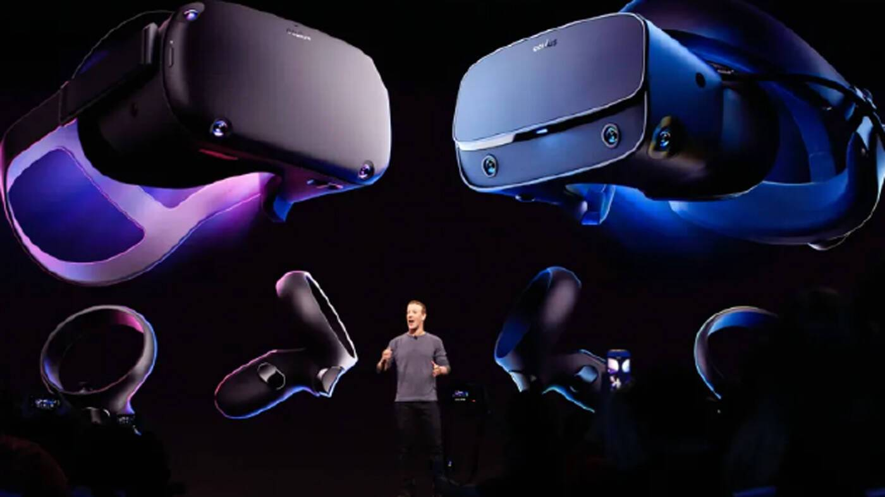

# 扎克伯格：Meta与苹果在元宇宙正面交锋，将决定互联网未来走向

# 扎克伯格：Meta与苹果在元宇宙正面交锋，将决定互联网未来走向

​         北京时间7月27日早间消息，据报道，Meta Platforms CEO马克·扎克伯格（Mark Zuckerberg）认为，Meta与苹果正在元宇宙建设方面展开“极其深刻的哲学竞争”，表明这两家科技巨头已经准备在增强现实（AR）和虚拟现实（VR）硬件销售领域正面交锋。

　　媒体获得的文件显示，扎克伯格本月早些时候在内部全员大会上表示，Meta与苹果的竞争是关于“互联网未来走向”的竞争。**他表示，Meta应该将自己定位成更加开放、实惠的苹果替代品。**据悉，苹果最早有望在今年晚些时候发布首款增强现实头显。

　　“这是哲学之争，是理念之争。他们认为，通过亲力亲为和密切整合自己的产品，就能创造更好的使用体验。”扎克伯格提到这场令其困扰的对抗时说道，“而我们认为，不同的企业在各自的专业领域还有许多事情可做，这样就能催生一个更加庞大的生态系统。”

　　自从Facebook更名为Meta后，扎克伯格一直在努力推广元宇宙的互用性理念。他认为，元宇宙将成为继智能手机之后计算行业的又一个崭新篇章。Meta最近还与微软、Epic Games和其他企业携手建立了元宇宙开放标准组织（Metaverse Open Standards Group）。他们希望能创建一套开放协议，方便人们带着自己的虚拟商品在未来的沉浸式3D世界间穿梭。

　　苹果并未参与该组织，但扎克伯格对员工表示，他对此并不意外。他解释了苹果硬件开发方式和紧密的软件控制方式如何帮助iPhone取得成功，但对于元宇宙而言，“很难预先判断开放和封闭的生态系统究竟哪一个更好。”

　　虽然苹果CEO蒂姆·库克（Tim Cook）已经透露出该公司对增强现实行业的兴趣，但与以往一样，他们始终对未公布的硬件计划闭口不谈。即便如此，各种信号都表明，苹果即将发布一款可以模糊虚拟现实和增强现实体验的高端头显。Meta则计划在今年晚些时候推出一款类似的头显，而且还在开发该公司首款真正的人工智能眼镜。

　　如果虚拟现实和增强现实果真如扎克伯格预期般蓬勃发展，Meta与苹果在他心目中的定位似乎就像是Android与iOS。事实上，这种类比已经体现得非常明显：Meta旗下的Quest头显已经允许用户侧载未经Meta虚拟现实商店认证的应用，这与谷歌的Android侧载机制类似。虽然Meta刚刚将Quest的价格上调100美元，但Meta的硬件依然在亏本或平本销售。

　　苹果与Meta从未真正在理念上达成过一致。前者在iOS推行的隐私新规导致后者每年损失数十亿美元广告收入——根据新规，第三方应用必须获得用户的明确许可才能通过追踪信息的方式展示精准广告。扎克伯格的这番评论则表明，即使当他在苹果开创的移动生态系统之外探索自己的道路时，双方依然要鏖战多年。

　　**以下是扎克伯格在6月30日的Meta员工大会上就该公司与苹果在元宇宙竞争问题上给出的回答：**

　　**员工提问：**苹果没有参与元宇宙标准组织，而且准备推出自己的增强现实眼镜。这会对Oculus和我们的生态系统产生何种影响？谢谢。

　　**扎克伯格：**我认为，苹果显然会成为我们的竞争对手，不仅在产品层面，还在哲学层面。我们以开放的态度从事这项业务，力争建设更开放的生态系统。我们在Android上努力促进更多领域的互用性。我们的元宇宙开发理念，是让你可以把自己的虚拟商品从一个世界带到另一个世界。我们还与你刚刚提到的其他公司共同建立了元宇宙开放标准组织，而苹果并未加入。但我认为这都在意料之中。从目前的几代计算设备来看，苹果已经成为封闭的计算提供商。

　　这是哲学之争，是理念之争。他们认为，通过亲力亲为和密切整合自己的产品，就能创造更好的使用体验。而我们认为，不同的企业在各自的专业领域还有许多事情可做，这样就能催生一个更加庞大的生态系统。

　　在我看来，有意思的地方在于，很难预先判断开放和封闭的生态系统究竟哪一个更好。回顾一下PC时代就会发现，Windows的规模显然遥遥领先，成为人们默认的常规产品。Mac表现很好，但我觉得，在那种环境下，PC和Windows是更好的生态系统。

　　在移动互联网时代则截然相反。Android设备数量超过iOS设备，但我认为在美国和西欧这样的发达地区，高端用户和许多引领文化的人及开发者都更喜欢iPhone和iOS。所以我才认为，苹果的确在移动互联网时代为自己打下了很好的基础，所以他们才成为全世界市值最高的公司，或者说是市值最高的公司之一。

​    　但我不认为元宇宙的未来已成定数。我们的工作就是继续展开前沿研究，全方面推进这一领域的发展。我们做VR，也做AR，我们出售设备时可能会亏本，或者提供少量补贴，有的时候也会略高于成本价。但底层逻辑在于，我们的主要目标不是在设备上做到极致，而是希望能有尽可能多的人参与互动。我们希望打造一个具备互用性的开放生态。

　　我们能否在这个十年结束时吸引10亿人进入元宇宙，让每个人在数字商务中花上几百美元？这是我们的目标。如果能做到，就能在这个十年内让新业务的规模与我们现有的广告业务比肩。这真的令人无比兴奋。想要实现这一点，关键就在于推广开放的元宇宙，这也是我们努力的方向。

　　所以，苹果会成为我们的竞争对手。我认为这很明确，但这种竞争并非流于表面。并不是说他们开发了一款比我们功能更多的产品。我们是在互联网的未来走向上展开非常深刻的哲学之争。我们目前的投资有助于推进开放的元宇宙，我对此颇感自豪，也希望能够让下一代计算系统变得更开放一些。
