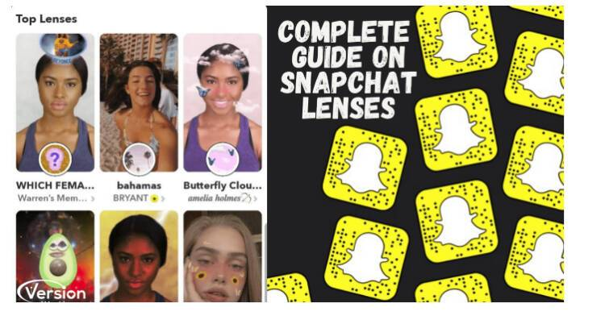

# Snapchat股价暴跌，元宇宙会成为它的“救命稻草”吗？

# Snapchat股价暴跌，元宇宙会成为它的“救命稻草”吗？

2022年7月21日，社交媒体公司Snapchat披露2022年第二季度财报，业绩低于市场预期，公司股价在盘后大跌40%，创2020年3月份以来收盘新低。

然而，不仅是Snapchat，在目前经济不确定的大背景下，Meta、谷歌等平台都经历着程度不一的困境，因此寻找新的收入来源或是实现公司的多元化似乎成为了一个更加可靠的解决方案。

国内的Soul作为一款瞄准年轻用户市场的社交产品，在元宇宙概念愈发火热的时候，将自己的产品定义为“年轻人的社交元宇宙”。

**尽管元宇宙概念还没有一个明确的定义，但元宇宙社交赛道早已成为了厂商们的新战场。**

据Sensor Tower（2022）报告显示，从元宇宙概念走红以来，平均每天都会新增一个“元宇宙”APP，而海外社交媒体软件Snapchat在几经转型后终于将自己发展成了全民级的产品。

此前Snapchat在全球生态合作伙伴大会上宣布在全球已经拥有超6亿月活用户，其在元宇宙的布局收获了不少用户的肯定，随着AR技术与生态的发展，Snapchat的可玩性也越来越高。

那么，Snapchat是如何布局社交元宇宙的，未来它会成为Snapchat的新增长点吗？

> **社交平台为何瞄准元宇宙？**

自从Roblox第一次将元宇宙概念写入其招股书中，元宇宙一词才走到聚光灯下，受到资本和其他企业的广泛关注。

而Roblox是一个独特的平台，本身并不生产游戏，而是提供一整套易用的工具，可以方便创作者制作想要的虚拟世界，并可以为这些虚拟世界设计经济模型和付费模式，创作者和平台共同分享这个虚拟世界带来的营收。

基于此，Roblox上诞生了数千万个不同的虚拟世界，并且任何人都可以参与其中游玩。

如此多风格特异的虚拟世界，迅速受到青年们的喜爱，再加上疫情的影响，青年们想要与伙伴在线下聚会的机会是越来越少了，而有了Roblox，大家可以在线上与朋友在不同风格的虚拟世界中进行游玩，借此，Roblox达到了惊人的5000万日活。

Roblox经过多年的沉淀和实践，十分清楚用户在元宇宙中最需要什么。Roblox竭尽全力地去营造社区内多元化、包容和尊重的氛围，社区欢迎所有人，无论他们是什么样的身份或者拥有怎样的信仰。

Roblox的愿景是，在Roblox上，人们可以成为任何他们想成为的人。

人是元宇宙中最关键的角色，而人与人之间的交互，也就是社交，是能让人沉浸在元宇宙中的重要因素。

正如Roblox给出的元宇宙的八大要素：身份、社交、沉浸感、低延迟、多元化、随地、经济系统、文明，社交就是其中的重要一环。

根据Roblox 2021年度报告显示，2021年，Roblox上的用户，每天会给朋友发送25亿条左右的聊天消息，同时社区内共产生了1700万个好友关系，而社交带来的强用户粘性也是Roblox能够持续常青的关键之一。

Roblox带来的惊人效果也启发了其他社交平台，吸引它们躬身布局元宇宙，比如最大的社交平台Facebook就是高调宣布全面进军元宇宙，甚至还将公司名改为与元宇宙相关的“Meta”。

又比如，基于兴趣图谱建立关系的国内社交平台Soul也紧跟元宇宙的步伐，面向Z世代用户的它们也看到了元宇宙对于Z世代的吸引力，迅速调整定位，致力于打造一个“年轻人的社交元宇宙”。

而国外最受Z世代喜欢的社交平台之一的Snapchat，则早在2019年就已经开始了元宇宙关键技术——AR技术的使用，并构建起了非常完整的AR生态，包括从内容制作、分发到变现，实现购物、社交对话等功能。如今Snapchat也在推出面向元宇宙的相关产品。

**作为深知社交会带来怎样的经济效应的社交平台，它们不约而同地积极入局元宇宙，一定是同一个原因，那就是元宇宙很可能将成为他们的新增长点。**

而社交平台本就是互联网最重要的组成部分之一，基于这个趋势，可以看出元宇宙本身也很可能成为下一代互联网的重要平台。

> **Snapchat是谁？**

Snapchat是一款“阅后即焚”的照片分享应用，从2011年发展至今，Snapchat已不仅仅是单纯的社交软件，而是整合了大量AR和相关技术功能的社交AR应用，那么Snapchat有着怎样不平凡的发展历程呢？

Snapchat的创始人之一埃文·斯皮格尔出生在洛杉矶一户富裕的家庭，从幼儿园到高中，埃文都在洛杉矶的私立精英名校Crossroads度过。

该所学校不仅有不少好莱坞明星子女，也诞生了很多日后的科技界大咖，而埃文在Crossroads的学习生涯中也积累很多有价值的经验。

埃文曾帮学校的校报Crossfire写文章，也曾在红牛饮料公司做过无薪实习生，这份实习经历让埃文学会了营销，还参与了与电脑和图形相关的设计项目。

埃文说自己很享受这个过程，或许也正是从这个时候开始，埃文的创业梦想的种子就已经悄然种下。

于是埃文在顺利进入斯坦福学习后结识了Bobby Murphy，他们曾经一起创办了一个教育网站，但是效果却差强人意。

所谓“车到山前必有路”，在2011年的夏天，与埃文同住一间宿舍的Reggie突发奇想：如果我能发送会消失的照片该多好啊。

很快他将这个创意告诉了埃文，随即两人一拍即合，并与主攻技术的Murphy达成合作，于是一个“阅后即焚”的图片分享应用——Snapchat诞生了。

**这个新的社交平台很快便在青少年之间流行开来，仅仅一年时间，Snapchat活跃用户就增至1000万。**

2013年10月，Snapchat推出了“Stories”故事分享功能，用户可以将快照功能添加到故事分享上，将一连串的照片拼在一起描述事情的经过。这一功能上线后，Snapchat应用开始步入了发展的“快车道”。

日渐成熟的平台也吸引了更多的用户，据统计，截止2014年8月，在美国有40%的18岁年轻人每天都在使用Snapchat。

而此时，Snapchat的总市值已超过了100亿美元，而埃文的个人净资产也已经高达15亿美元。

Snapchat很快引起了巨头公司的注意，自该平台上线一年以来，腾讯、Facebook以及谷歌都曾对Snapchat提出高价收购方案，但都遭到了埃文的拒绝。

随着Snapchat不断的迭代和新产品功能的推出，平台的用户数也随之增长。

2015年，Snapchat又开始了一次全新的尝试：Lenses，其在相机上逐渐丰富了AR效果，而这种可交互的AR效果让Lenses迅速火爆。

同时Snapchat也在不断探索着各种商业化变现的模式，但社交应用领域的竞争也愈加激烈。

2017年3月Snapchat在纽约证券交易所正式上市，估值达到336亿美元，尽管这是自Facebook上市之后美国企业最大规模的IPO，Snapchat也没有摆脱用户数量下降和公司亏损的困境。

**但Snapchat仍在继续努力，试图在变化迅速的社交媒体赛道中找到自己的位置，于是AR成为了Snapchat主攻的方向，也逐渐成为了其实现业务增长的有利武器。**

> **Snapchat如何布局元宇宙？**

尽管Snapchat创始人埃文拒绝谈论元宇宙，认为元宇宙是模棱两可、具有假设性的，但事实证明，Snapchat已经通过押注AR应用迈入了元宇宙的重要入口，成为了一名元老级玩家。

Snapchat于2017年上市，但上市一年期间多次因来自Facebook、Instagram、TikTok等竞争对手的巨大压力和内部产品缺陷等原因，造成公司业绩一度惨淡。

面对着这样的挑战，埃文做出了技术创新的重要决定——将AR应用作为主攻方向。

此后，**Snap由一家“社交应用公司”转型成了“通过相机让人们自我表达、活在当下、探索世界和一起享乐”的“相机公司”，并发布了一系列产品实现了顺应品牌发展的“AR元宇宙”全方位布局。**

**AR相机特效**

提到Snapchat的产品，当属相机为其最核心的功能应用。

自2018年开始，团队自主开发了移动 AR技术底层，以及大量前端的特效和贴纸，而这些相机特效被统称为Lens。

Snapchat通过AR强化相机体验，并以滤镜形式应用于APP内，多年来已形成了超2.5亿的ARLens日活用户，互动次数高达每日60亿次。

**AR生活感知**

除了相机特效外，Snap还将AR开发出了许多应用场景，适用于更多渗入生活的感知体验

与传统在线购物相比，AR体验提升了用户在线消费的“沉浸感”和“愉悦感”，因而带来了近乎提升一倍的购物转化率。

例如，Prada、Gucci可在Snapchat中在线试穿、随意切换款式、查看搭配效果。另外，Farfetch等购物平台也在Snapchat中搭建了AR在线商店，用户可以在线逛街，以虚拟方式享受线下的生活乐趣。

今年年初，国际巨星Jennifer Lopez的粉丝以各自的Bitmoji虚拟形象，在Snapchat举办的全球首次超感官体验的虚拟演唱会上，与偶像一起登台演出，狂欢尖叫。

从在线虚拟演唱会到音乐节，Snap已经实现将AR技术应用于内容更复杂、时长更长久、视觉更华丽的演出现场。

Snapchat曾推出“Landmarker”系列滤镜重现各国著名景点，足不出户便可“实地参观”美国国会大厦、白金汉宫、埃菲尔铁塔等经典地标。

并且，Snapchat还给建筑地标赋予了AR创意互动特效，增强了用户的交互体验感。

用户打开Snap Camera，便可观看Sandra de la Loza和Kang Seung Lee的新数字装置，还可参加Snap与Jeffrey Koons、KAWS等知名现代艺术家合作开展的各种AR艺术活动。

未来，即使在家中、在户外、在世界的任何一个角落，都能欣赏到视觉盛宴，这本身已经算是一种现代艺术。

**AR开发环境**

在今年的发布会上，Snap公司发布了一个专门面向AR的开发环境——Lens Studio。

简单来说，Lens Studio可被理解为AR版的Xcode/Android Studio，AR开发者可以使用这个开发环境来制作AR特效，并且可将其用于Snapchat或其它第三方应用，这项新产品无疑为广大开发者降低了开发门槛，为AR领域注入了更多活力。

同时，Snap还推出了功能更加全面的数据分析工具。在新版Lens Studio当中，开发者将可使用Event Insights功能查看用户使用AR特效的交互统计数据，更好地修复特效漏洞、改善用户体验。

**AR后端服务**

除了开发环境外，Snap还为专业的AR开发者提供了一套云端工具——Lens Cloud。它将提供一整套包括远存储服务、基于地理位置的服务以及多用户服务等在内的免费后端服务。

具体来说，复杂的AR特效可能包括大量素材，但开发者可以将素材都保存在云端，用户使用时自动调取，就能显著降低特效在手机本地内存的压力；同时，存储服务还包括持久存储能力，意味着用户能够像保存游戏进度一样，保存多次使用的同一个AR特效。

另外，基于地理位置的服务还能够允许开发者将AR特效绑定到真实世界中的地标，增强用户的生活感知；而多用户服务则可以让多个用户同一时间在相同或不同的地点，与同一个AR特效进行交互。

事实证明，Snapchat这几年可谓是铆足了劲儿，从产品的开发到使用，再到品牌影响力的打造，形成了一整套闭环的AR发展体系，同时也建立起了一个蓬勃生长的线上社交生态。

AR应用已然成为了Snap公司与一波又一波社交平台竞争的强大优势，也成为了业务增长的利器。而Snapchat凭借自己的创新与专业，不仅做好了AR领域的“第一个吃螃蟹的人”，更是成为了最先交付元宇宙承诺的领先平台之一。

> **元宇宙能拯救Snapchat的股价吗？**

上周四盘后，Snap公司的最新季度报公布，导致其股价大跌40%，直逼“腰斩”边缘，当然，和上个季度的股价相比，Snap确确实实已经腰斩，所以，从投资者的反馈来看，他们似乎并不认可目前Snap的估值。

从财报数据来看，Snap第二季度营收为11.11亿美元，与去年同期的9.821亿美元相比增长13%；净亏损为4.221亿美元，与去年同期的净亏损1.517亿美元相比扩大178%，这意味着增长和亏损几乎抵消了，整体净利润必然下滑。

当然，因为AR的加持，其社交应用Snapchat的用户还是迎来了较大增长，日活跃用户达到了3.47亿，同比增长5400万，增幅为18%，因此，尽管财报表现不那么亮眼，但用户数还并算糟糕，这与其竞争对手Meta的财报形成了鲜明对比。

可以说，Snapchat因为在AR板块的重金投入，导致了其成本的上升，这为本季度财报的糟糕表现埋下了伏笔，但从本质来说，还在于Snapchat在目前的互联网发展上来看，已经与Meta一样面临着各类增长困境，急需要新的产品来满足用户需求，或者跟上用户述求。

因此，发力AR板块成为了如Meta发力元宇宙一样的逻辑，但正如之前的描述，**Snapchat创始人一直反对使用“元宇宙”这词来表达自己在AR方面的布局，这与苹果的CEO库克如出一辙，虽然不提元宇宙，但已经身体力行的在布局元宇宙相关产品了。**

当然，我们可以抛开元宇宙本身来谈Snapchat的布局，正如我们介绍的，在AR领域他们已经尝到了一些甜头，甚至引发了年轻用户的加持，这是诞生11年的Snapchat所需要的新鲜血液，否则原本主打年轻用户的Snapchat也会陷入“老龄化”的趋势。

如果回到元宇宙来说，Snapchat未来还有很多想象空间，尤其是Web3依旧火热的今天，Snapchat能否从现在庞大的用户体量中找到一些新的趣味性，似乎成为了他们重点发力的地方，而元宇宙的想象空间又印证了这一事实，毕竟未来还未成型，谁也不知道终局。

但可以肯定的是，Snapchat在不愿提及元宇宙这个词的同时，已经靠着它走向了“第二增长曲线”，或许这会给不少社交产品带来启示。
