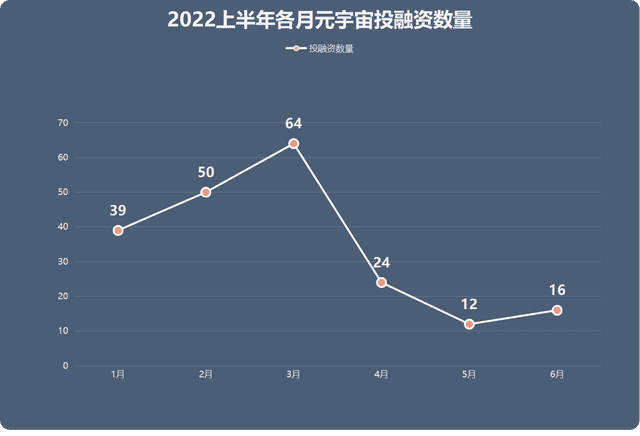
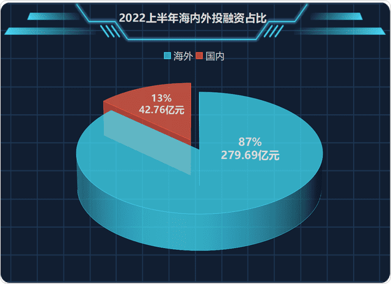
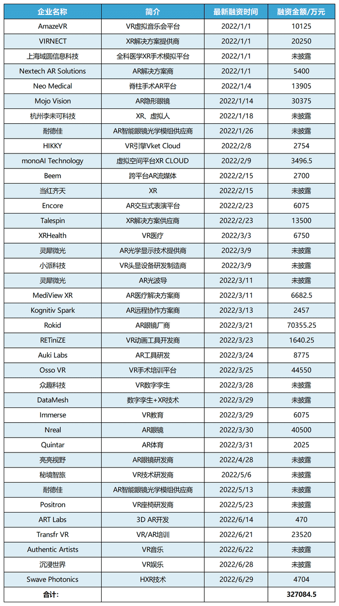

# 2022元宇宙年中投融资报告：投融资规模爆发式增长

2021年元宇宙概念大放异彩，全球范围内资本不断涌入这个新兴领域，2021年因此被认为是继“VR元年”之后的“元宇宙元年”。

这一年，全球首个将“元宇宙”概念写进招股书的公司Roblox，在登陆纽交所后公司市值突破400亿美元；佳士得首次以非同质化代币（NFT）形式拍卖的作品《每一天：前 5000 天》最终以 6934.6 万美元天价成交；全球最大社交媒体公司Facebook宣布改名为Meta，All in 元宇宙。

元宇宙之所引起全世界的关注，本质上在于，我们从PC互联网过渡到移动移动互联网已有10年时间，但下一代互联网形态却仍未形成共识，而元宇宙概念综合了将当前主流前沿技术，对未来互联网形态进行了初步表述。因此进入2022年后，关于元宇宙概念的阐述和表达，继续以各种形式频频亮相于资本市场。

这个源于科幻小说《雪崩》的词汇，最初只是书中描绘的一个虚拟世界，如今，随着AR/VR相关技术的进步，以及疫情对现实世界的重塑，元宇宙概念逐渐有了实现基础和现实诉求，体现在资本市场上便是投融资事件爆发式增长，相关概念企业如雨后春笋般涌现。

同时，元宇宙概念的前瞻性和复杂性决定了，它必然指向一个庞大的产业生态，这个生态将由那些细分产业构成？这些相关产业将朝着哪些方向变革？未来又将面临怎样的挑战？本报告将在2022年一季度投融资数据的基础上，从元宇宙的定义、发展脉络、热门赛道、政策风险等维度进行解析，以此来厘清元宇宙领域相关企业投融资现状，为相关从业者提供一个深入了解元宇宙的视角。

免责声明：本报告由新浪VR与企查查大数据研究院联合发布，旨在供内部人员交流学习使用。本报告仅供参考，不构成投资建议。转载、摘编或利用其它方式使用本报告文字、图片、观点，应注明“来源：新浪VR、企查查大数据研究院”。

# 一、元宇宙基本概念

**1.元宇宙的定义**

元宇宙一词最早出自1992年出版的科幻小说作家尼尔·斯蒂芬森的《雪崩》里提到的“metaverse(元宇宙)”和“Avatar(化身)”这两个概念。而直到近两年，元宇宙才开始受到关注。报告认为，元宇宙是一个平行于现实世界，又独立于现实世界的虚拟空间，是映射现实世界的在线虚拟世界，是越来越真实的数字虚拟世界。元宇宙是在扩展现实(XR)、区块链、云计算、数字孪生等新技术下的概念具化。

技术手段上，元宇宙是一个以AI、VR、AR、区块链等前沿科技为支撑，能够实现与现实世界无缝衔接、相互作用的虚拟世界，可以看作是互联网的实体化和具象化，人类可以在其中生活、工作、进行商业活动和经济建设。

核心特征上，元宇宙能够为用户提供：沉浸式体验、开放性接口、虚拟身份、创作者经济、去中心化治理、各类型基础设施。

产品体验上，元宇宙的实现需要八大要素：身份、朋友、沉浸感、低延迟、随地登陆、经济系统和文明。

**2.元宇宙核心要素**

元宇宙主要有5大核心要素：5G、云计算、VR/AR、人工智能、数字孪生、区块链。其中，5G为元宇宙提供了通信基础，云计算为元宇宙提供了算力基础，脑机接口、VR/AR等为元宇宙提供了真实的沉浸感，人工智能为元宇宙提供了内容生成逻辑，数字孪生为元宇宙提供了世界蓝图，区块链则为元宇宙提供了认证、信任机制。

**1.1 5G**

元宇宙的目标是要创造一个更加真实和庞大的虚拟世界，能够容纳亿级的人在线互动。无论是当前的VR/AR，还是未来的元宇宙，他们必须奔跑在一条康庄大道上，普通的羊肠小径或者山路十八弯是肯定配不上未来的高科技。那从网络或者通信的角度来看，其实无非就是带宽、延时和可靠性三个维度。也就是说，元宇宙需要网络或者我们的通信平台有超高的带宽、超低的时延和超高的可靠性。

就目前来看，我们的5G仅可以实现基础的支撑，只有在6G的情况下才可以沉浸式的体验。对于5G而言，VR/AR、无线娱乐、社交网络、个人AI辅助等元宇宙最基础的场景都可以支撑，但涉及到沉浸式的XR、全息影像和感官互联等高阶应用场景，就非6G莫属了。

**1.2 云计算**

元宇宙的沉浸感，低延时，随地特性，不仅对VR/AR硬件技术，和网络传输系统提出了很高的要求，还取决于高性能的云计算能力和流媒体技术。没有强大的云计算和大数据能力，很多企业就难以在这场元宇宙争夺战中占领先机。

云计算对元宇宙的作用主要体现在三个方面：一是让人们能够轻松访问元宇宙。只需要有网络，可用的硬件设备，就可以链接进入元宇宙，体验元宇宙。企业可以通过在云上构建产品和服务，来增加公众对它们的访问。元宇宙是许多技术的一体化聚合，也得益于云无限和快速的吞吐量，可以将单个技术组合成一套融合技术。

二是减少宕机情况。如今我们使用电脑主要根据电脑的性能。考虑到元宇宙的复杂，我们只能够通过云计算来连接元宇宙，不可能依靠硬件的好坏。元宇宙一般上都会要求7天24小时的无间断运转和服务器的零宕机。云厂商可以提供可靠的无线连接和信号传输服务，以及元宇宙的VR和AR集成。

三是能为用户提供更好的体验。企业可以确保元宇宙的用户良好体验，用户体验包括：一致的高性能数据计算、服务器低延迟、安全性、易用性和高效协作。游戏体验呢，最重要的肯定就是游戏的流畅度，毕竟没有人会喜欢体验一个玩起来不顺滑的游戏，而云计算可以降低元宇宙游戏的延迟感。

**1.3 人机交互**

2022年一季度，全球VR头显出货量为356.3万台，其中Oculus份额占全球VR市场的90%；中国VR头显出货量为25.7万台，同比增长14.8%。

国内外VR头显设备销量处于快速增长之中，若下游应用场景拓宽将进一步加快VR头显的破圈速度，加上国内各省市政府对于元宇宙、虚拟现实、增强现实、沉浸式体验等产业较为重视，也陆续出台了各类发展规划文件与相应的扶持政策，VR/AR有望进入发展快车道。

可以预见，VR/AR技术在未来5年内仍将是用户关注的主要领域。尤其是VR/AR领域下游应用场景广阔，与传统产业进行深度融合的“虚拟现实/增强现实+”的机会较多，有充分的可挖掘创意空间。随着虚拟现实产业链的逐步完善，VR对各行各业的赋能效果将会呈现出巨大效应，并逐步拓展到公共服务、教育、娱乐、新闻传播、工程制造等诸多领域。

**1.4 人工智能**

人工智能研究包括机器人、语音识别、图像识别，是自然语音处理和专家系统等方面人工智能的研究，是对人的意识、思维的信息过程的进行模拟，研发出

各种各样的机器人、音响设备等，能够与人进行交流互动，能像人那样思考并超过人的智能。

未来，随着人工智能理论和技术日益成熟，应用领域也不断扩大，元宇宙将是人工智能真正的主战场。在2021年世界人工智能大会开幕式上，百度的小度、小米的小爱同学、微软的小冰、B站的泠鸢等四个虚拟人与真人主持同台出场，阿里巴巴的天猫精灵、小米的小爱同学等都具有语音唤醒、点歌、讲笑话等功能，百度的导航软件可以呼唤小度进行导航，更牛叉的是阿尔法狗围棋机器人，2017年5月与排名世界第一的世界围棋冠军柯洁对战，以3:0的总比分获胜。

**1.5 数字孪生**

元宇宙代表的并不只是一个连通消费群体、承载娱乐内容、呈现购物或业务协作场景的平台。它更是在全虚拟环境下建立的物理世界副本，使用者可以借助VR或AR等技术利用它反过来优化物理现实。作为元宇宙的基础技术之一，数字孪生所强调的正是这种立足数字环境访问物理现实的能力。

数字孪生作为一种对于既有对象或系统的、跨越其完整生命周期的虚拟表示，经由实时数据进行更新，并使用模拟、机器学习及推理等技术助力决策。数字孪生帮助我们在数字环境下重构物理世界，并映射出其中每一个微观细节。在先进传感器、AI以及通信技术的支持下，这些数字空间中的副本能够精确模拟包括人体、设备、事物、系统乃至地点在内的各类物理对象。

**1.6 区块链**

基于区块链技术的加密货币能够为元宇宙提供交易媒介和稀缺性，让其中的事物获得价值锚定物，有了价值锚定物就有了交易，有了交易就有了商业形态和经济模型。

区块链作为元宇宙的一个组成部分，其技术价值会在元宇宙中不断推动实体经济与数字经济的深度融合，为元宇宙提供一个开放、透明的协作机制。尤其是区块链带来的去中心化的“信任”，是元宇宙创造可信的资产和身份认证的基础，让元宇宙中的价值创造和价值自由流转变得更加高效便捷。受制于区块链目前的底层基础建设，元宇宙目前的确很难有大的施展空间。不过当一系列基础设施发展成熟，加AR和VR设备、大数据、云计算这些技术的进一步成熟并且落地。

**3.元宇宙发展趋势**

自2021年破圈，到如今资本市场百花齐放，元宇宙仅仅用了一年多的时间，市场规模从2020年的500万美元增至2021年的1700万美元。

2022年上半年，元宇宙相关投融资依旧保持着强劲增长势头，全球范围内元宇宙相关投融资事件共205余件，总投融资规模超322亿美元（未知数额的千万元级别融资按1000万元计算），预计2030年将达到15000亿美元的市场规模。同时，参与投融资的企业开始把元宇宙概念和国内环境、自身业务结合，向个性化、商业化方向过渡。

从整体趋势上看，在当前全球经济萎靡的大环境下，元宇宙的出现无疑为未来经济形态提供了新思路，若能健康持续推进，将成为全球经济新增长点和极具战略意义的竞争领域，传统互联网巨头的守与元宇宙新贵将上演一场攻防战，全球科技产业的新一轮革命已是山雨欲来。

具体到行业发展，从业者需清醒认识到，现阶段元宇宙还处于初期发展阶段，许多问题悬而未决，个别赛道前景并不明朗。

首先是其底层技术支撑如AR、VR、区块链等技术虽然发展迅速，但都远未到成熟阶段，目前在应用场景上目前也相对匮乏；其次元宇宙是一个庞大的系统工程，除了技术方面外，合规风险、安全隐患、社会伦理等方面都需要协同发展，只有多领域、各圈层的服务和基础设施不断完善，元宇宙这一概念才有最终实现的可能。

# 二、元宇宙发展现状

**1.元宇宙政策风向**

2020年以来 ，数字化转型一直是国内重点推进的政策之一，而元宇宙概念恰恰与数字化转型高度重合，因此，从2021年开始，无论是国家层面还是各地方政府，针对元宇宙相关产业的政策设计已开始有序推进。

在国家层面，中央纪委国家监委曾于2021年12月在文章《元宇宙如何改写人类生活》中表示，要理性看待元宇宙带来的新一轮技术革命和对社会的影响，不低估5-10年的机会，也不高估1-2年的演进变化。

今年1月，工业和信息化部在中小企业发展情况发布会上表示，要特别注重培养一批深耕专业领域工业互联网、工业软件、网络与数据安全、智能传感器等方面的“小巨人”企业，培育一批进军元宇宙、区块链、人工智能等新兴领域的创新型中小企业。

除了国家部委级较为积极的表态外，地方政府也在不断展开布局，且针对元宇宙相关产业的布局相对更加宽松、具体。

比如2021年12月，上海市印发了《上海市电子信息产业发展“十四五”规划》，首次将元宇宙写入地方政府工作报告，提出探索新一代信息技术融合应用，围绕人工智能+大数据、云计算+边缘计算、5G+扩展现实、区块链+量子技术、云边端协同、数字孪生+数据中台等方面，推进技术协同攻关、标准规范制定和平台建设、应用创新等。

此外，上海发布的《上海市建设网络安全产业创新高地行动（2021-2023）》、《金融科技发展规划（2022-2025）》等文件均涉及元宇宙建设。

截止2022年6月，已有7省17市地方政府相继发布元宇宙建设规划，分别是浙江、山东、江西、河南、贵州、安徽、黑龙江7省，以及北京、上海、广州、深圳、重庆、成都、沈阳、武汉、杭州、南京、厦门、合肥、南昌、无锡、海口、三亚、保定17市。

**2.国内省级布局**

浙江：1月5日，浙江省数字经济发展领导小组办公室发布的《关于浙江省未来产业先导区建设的指导意见》提出，元宇宙与人工智能、区块链、第三代半导体并列，是浙江到2023年重点未来产业先导区的布局领域之一；浙江将加快在脑机协作、虚拟现实、区块链等领域搭建开放创新平台，促进产业技术赋能和集成创新。

河南：1月6日，在政府工作报告中指出，大力发展“区块链+”新型业态，培育碳基新材料、第三代半导体等产业集群，形成“研发+产业+应用”链式推进格局。制定区块链建设专项方案并积极推进。实施国家级新型互联网交换中心、人工智能计算中心、中国移动网络云郑州大区中心等重大项目，推动传统基础设施智慧化升级。

江西：2月14日，江西科技厅将2022年定位为VR产业发展质量突破年，探索成立元宇宙联盟，打造国内一流的元宇宙研发平台，重点布局元宇宙硬件入口、底层架构、人工智能、内容与场景四个方向的规范标准制定和开发工具监制；重新梳理完善虚拟现实关键核心技术和“卡脖子”技术目录，开展元宇宙发展重点和发展路径探索；支持南昌规划建设元宇宙试验区，打造数字经济产业集聚区，重点发展VR/AR、人工智能与5G、数字文创等数字经济重点产业。

5月25日，江西省人民政府印发《江西省“十四五”数字经济发展规划》，指出要紧跟新一代信息技术发展步伐，积极布局VR、“元宇宙”及数字孪生、信息安全和数据服务、物联网、智能网联汽车、无人机等新兴领域，前瞻布局量子信息、卫星互联网、区块链、人工智能等前沿领域，力争实现“弯道超车”“换车超车”，为全省数字经济发展注入新动力。

贵州：3月4日，贵州省将做大做强算力产业，推动VR/AR产业发展，夯实元宇宙发展基础。同时，贵州注重人才的引培工作，为元宇宙产业提供智力支持。建立元宇宙专家库，加大产业领军人物和高端人才的引进。

山东：3月21日，山东省工业和信息化厅等七部门联合发布《山东省推动虚拟现实产业高质量发展三年行动计划（2022-2024年）》（下称《计划》），将用三年时间在全省培育推广百项应用场景及解决方案，打造国内一流、具有国际竞争力的千亿级虚拟现实产业高地。力争到2024年，全省虚拟现实领域要累计新增申请国际、国内专利3000项以上，龙头企业研发投入强度达到6%以上，累计培育虚拟现实产业相关专业人才1万人以上。

黑龙江：3月28日，黑龙江人民政府印发《黑龙江省“十四五”数字经济发展规划》，对元宇宙发展提出了部署计划。具体如下：

推进元宇宙核心技术与主要应用领域关键技术研发应用，支持围绕近眼显示、实时交互、巨量通信、边缘计算、3D建模与渲染、图像引擎等开展研发创新，构建元宇宙技术体系，前瞻布局元宇宙产业。鼓励推进元宇宙在公共服务、智能工厂、城市治理、建筑信息系统与城市信息系统（BIM/CIM）、远程医疗、商务办公、智慧会展、社交娱乐等领域的场景应用，培育以应用牵引、软硬结合、创新集聚、绿色低碳的元宇宙发展生态。

推动元宇宙试验区建设，依托哈尔滨人工智能创新发展试验区和高校、科研院所等载体，构建元宇宙技术研发基地和产业孵化基地，构建全省体积视频公共服务平台，促进沉浸式视频节目（直播）、元宇宙演唱会、演绎式娱乐等新兴业态集聚。

安徽：3月29日，安徽省经信厅发布了《安徽省“十四五”软件和信息服务业发展规划》，将元宇宙列为新兴业态创新工程之一。支持企业开展虚拟现实、增强现实、3D引擎、物联网等技术创新，引导企业积极布局元宇宙新兴业态，开展元宇宙平台建设，加速数字技术融合赋能实体经济。

**3.国内城市布局**

北京：出台《关于加快北京城市副中心元宇宙创新引领发展的八条措施》，将依托通州产业引导基金，采用“母基金+直投”方式联合其他社会资本，打造一只覆盖元宇宙产业的基金，支持元宇宙初创项目和重大项目，完善服务体系，支撑产业生态建设，支持设立专注于早期和长期投资的元宇宙子基金。

同时，将给予元宇宙企业房租财政补贴。支持元宇宙企业及服务机构集聚，根据元宇宙企业房租补贴标准，对在元宇宙应用创新中心新注册并租赁自用办公场地的重点企业进行（50%，70%，100%）三档补贴，每家企业每年补贴面积不超过2000平方米，连续补贴不超过3年。

2022全球数字经济大会将于7月28日至30日在北京举行，本届大会拟策划全球万人数字安全元宇宙峰会，将深度探讨互联网3.0、数据要素、5G创新、数字安全、开源、东数西算等前沿领域。

上海：印发《上海市电子信息产业发展“十四五”规划》，这是元宇宙首次被写入地方政府工作报告，《规划》提出，加强元宇宙底层核心技术基础能力的前瞻研发，推进深化感知交互的新型终端研制和系统化的虚拟内容建设，探索行业应用。——新一代信息技术融合应用，围绕人工智能+大数据、云计算+边缘计算、5G+扩展现实、区块链+量子技术、云边端协同、数字孪生+数据中台等方面，推进技术协同攻关、标准规范制定和平台建设、应用创新等。

上海发布的《上海市建设网络安全产业创新高地行动（2021-2023）》、《金融科技发展规划（2022-2025）》等文件均涉及元宇宙建设。

深圳：成立元宇宙创新实验室，已成功对接海内外超过26个国家的用户和技术团队，福田区将大力发展数字新基建、数字新科技、数字新智造、数字新金融、数字新文化、数字新商贸六大数字产业，积极引进数字经济领军龙头企业和示范项目，推动区块链、量子信息、类脑智能等未来产业的技术转化成果加速落地，多领域拓展数字人民币、元宇宙等技术应用场景，扎实推进深圳数据交易中心建设，打造数字经济发展新高地。

广州：4月，粤港澳大湾区首个元宇宙专项扶持政策《广州市黄埔区、广州开发区促进元宇宙创新发展办法》发布，以期引领新一轮科技革命和产业变革，为广东省、广州市元宇宙领域产业发展提供试点经验和示范引领。出台大湾区首个专项扶持政策，推动高质量发展集聚发展新势能。黄浦区将从建设具有黄埔特色的元宇宙标志性场景、元宇宙关键共性技术与通用能力的价值创新与公共服务平台、特定研究方向的元宇宙相关项目等三个层面进行奖励，最高补贴分别达 500 万元。

5月，天河区元宇宙联合投资基金正式发布，总规模逾200亿元；首批天河区十大元宇宙试点园区正式授牌，释放超10万平方米产业空间；十五大元宇宙应用建设项目集中签约，推动场景落地。据悉，广州联通作为本次会议唯一通信运营商，率先进驻15个元宇宙应用场景建设项目，与正佳广场、网易、酷狗等30家单位集中签约，打造AI未来影像创作中心，加速元宇宙的应用场景落地。

重庆：重庆市《渝北区元宇宙产业创新发展行动计划（2022-2024年）》提出，抢抓数字经济和元宇宙发展新机遇，打造“ 元宇宙先导试验区”和“ 元宇宙生态产业园”，构建元宇宙治理与产业发展体系。

力争到2024年，在工业、交通、文旅、商贸、教育、医疗、会展、政务等领域，构建形式多样的 元宇宙新模式新服务新业态，元宇宙技术研发和应用推广取得明显进展。基本建成 元宇宙产业创新生态体系，高端研发机构、专精特新“小巨人”企业高度集聚，推动“创新链、研发链、人才链、价值链、产业链”融合发展，元宇宙产业集群化发展效果显现。

成都：政府工作报告提出，推动新经济新赛道加快布局。大体发展数字经济，用好网络信息安全、超算中心等优势赛道，加快发展人工智能、大数据、云计算等新兴赛道，主动抢占量子通信、元宇宙等未来赛道，立正数字经济核心产业增加值占地区生产总值12.8%以上。

合肥：在政府工作报告中提出，前瞻布局未来产业，瞄准量子信息、核能技术、元宇宙、超导技术、精准医疗等前沿领域，打造一批领航企业、尖端技术、高端产品，用未来产业赢得城市未来。

武汉：政府工作报告提出，提升数字经济发展水平。加快壮大数字产业，推动元宇宙、大数据、5G、云计算、区块链、地理空间信息、量子科技等与实体经济融合，建设国家新一代人工智能创新发展试验区，打造小米科技园鞥5个数组经济产业园。

南京：政府工作报告提出，加快元宇宙产业链上下游各环节各主体的协同发展，促进元宇宙与区块链、人工智能、云计算的创新融合，积极构建新金融、新产业的强磁场，新技术、新产品的孵化器，新体系、新模式的试验田，推动更多应用场景落地。

5月26日，2022南京市元宇宙产业发展大会在江宁上秦淮国际文化交流中心隆重举办，大会围绕元宇宙产业加快布局新赛道，紧扣城市数字化转型。全力促进南京市元宇宙产业技术赋能和集成创新，积极支撑全市打造万亿级软件产业和数字经济创新发展高地建设。

厦门：印发《厦门市元宇宙产业发展三年行动计划（2022-2024年）》，提出围绕元宇宙重点领域关键技术实施重大科技专项。强化部、省、市联动，积极争取国家、省重大科技专项在我市布局并实现成果落地转化。鼓励企业、高校及科研院所采用“赛马机制”和“揭榜挂帅”方式，对NFT、VR/AR、脑机接口、智能芯片、智能算法等元宇宙关键技术进行协同攻关，支持元宇宙领域的前沿技术突破。

5月23日，厦门“元宇宙产业人才基地”揭牌，该基地由厦门火炬高新技术产业开发区管理委员会、中共厦门市委人才工作领导小组办公室等单位联合指导，由工业和信息化部人才交流中心、福建省区块链协会、厦门市云大物智数据研究院、Watson Build 创新中心等单位提供多维专业支持。

南昌：南昌市政府工作报告在2022年工作安排中提到，打造全国重要会展目的地，办好2022世界VR·元宇宙产业大会、2022中国航空产业大会暨南昌飞行大会等系列重大活动。

杭州：政府工作报告提出，加快推进人工智能、区块链、虚拟现实、元宇宙等新技术、新产业发展。成立元宇宙专委会；入选区块链创新应用综合性试点名单。

3月，杭州未来科技城提出汇聚规模10亿元的XR产业基金，鼓励社会资本参与投资，优质项目最高可享受500万创业风险池等支持；加大对XR产业人才引进力度，实施“顶尖人才项目”政策，最高给予1亿元支持，形成XR专项人才培育机制，完善XR人才服务保障，最高给予300万元安家费补助。

5月，杭州钱塘“元宇宙”新天地开园。该项目将围绕数字孪生、人工智能等“元宇宙”核心底层技术，以及游戏、社交、教育等“元宇宙”新型应用场景，引进培育一批创新型中小企业。《杭州钱塘区“元宇宙”产业政策》正式发布，将围绕人才引领、空间保障、基金助力、梯队建设、协同创新等五大计划。

沈阳：据辽宁省沈阳市发布的《和平区元宇宙产业创新发展行动计划》，力争到2024年构建元宇宙产业发展的“产学研用政金”一体化新模式，搭建元宇宙产业创新生态体系，建设东北元宇宙创新发展第一区。将抢抓数字经济和元宇宙发展新机遇，组建一个产业联盟、开放一批商业应用场景、扶持一批优质企业、培养一批产业创新人才、制定一批行业标准，构建元宇宙治理与产业发展体系，塑造沈阳市数字经济新优势，建设东北元宇宙创新发展引领区。围绕元宇宙7大核心技术，即区块链技术、交互技术、电子游戏技术、网络及运算技术、人工智能技术、物联网技术、工具软件技术的发展。

海口：政府工作报告提出，复兴城市产业园加快国际数字港、国家文化出口基地、国家区块链技术和产业创新发展基地、元宇宙产业基地、集成电路公共服务平台等项目建设，拓展年轻人创新创业空间。

三亚：与网易签署战略合作协议，建设网易元宇宙产业基地；该基地旨在推动海南数字化文创产业高质量发展，将被打造为集互联网技术开发、数字化内容生产、数字化版权运营和数字化产品输出为一体的国际化数字新文创中心。

无锡：发布《太湖湾科创带引领区元宇宙生态产业发展规划》，未来滨湖元宇宙产业将以核心技术突破为基础，以产业集聚为导向，在元宇宙生态产业发展上做到“四合”：空间布局和产业推进相结合、应用引领和场景驱动相融合、协同发展和一体发展相整合、市场主导和政府引导相契合，率先形成元宇宙发展的“滨湖方案”。

保定：保定市政府工作报告在2022年工作安排中提到，结合首都都市圈发展规划，全面对接北京产业链，大力实施“京保协作五个一”行动，积极谋划集成电路、人工智能、拓展现实和超高清显示、区块链、交互娱乐、元宇宙、新型细胞治疗、基因编辑等未来产业，努力让前沿科技率先突破、先进理念率先应用、未来生活率先体验，全力建设开放共享的产学研用试验场。

**4.元宇宙产业结构**

元宇宙基础设施层包含通信网络基础设施、算力基础设施和新技术基础设施，主要负责数据的实时传输与分发、存储计算与处理、挖掘与分析决策。如果将元宇宙看作一个大的应用场景，支撑这个应用场景的４层元素分别是：接入层的感知和显示、内容应用层、平台层、网络技术层。

感知及显示层：VR/AR、体感设备、脑机接口等技术提供进入元宇宙的入口。

内容应用层：产生元宇宙的所有数字内容和应用。包括游戏，娱乐，社交，数字产品，经济活动，办公，生产应用等。

平台层：支持虚拟社区环境搭建、社区规则、以及上层应用层开发的各项技术。比如街道、建筑物等基础设施的生成和导入；游戏引擎、内容分发平台等应用支持技术；支持各种智能应用和互动的人工智能算法也在这一层。

网络技术层：包括5G、云、互联网、去中心存储等技术，是元宇宙的底层网络技术保障。

**5.元宇宙企业布局**

元宇宙概念破圈后，国内外均涌现出不少元宇宙概念股。比如海外的Meta、微软、Roblox等企业，以及国内的歌尔股份、天下秀等。若从公司背景划分，这些元宇宙概

念企业主要包括四类参与者：互联网厂商、硬件技术厂商、软件技术厂、新创业公司。

第一类是互联网厂商，包括美国的Meta，Google，Amazon，中国的百度、阿里巴巴、腾讯等。这些互联网巨头企业大都拥有元宇宙所需的多项技术、庞大的用户基础、以及丰富的应用场景，同时也在多方位的着手元宇宙布局。在元宇宙未来的版图里，大概率还是会占据元宇宙平台建设者和大一统社区缔造者的角色。

第二类是软件公司，代表企业Microsoft，在元宇宙的四层都有布局，目前侧重于企业元宇宙。在未来的元宇宙世界，微软和互联网公司之间还是会有较多竞争。在接入层、平台层、网络技术层，微软和互联网企业都有布局，会形成竞争局面。在应用层面，微软侧重企业元宇宙，其他互联网企业目前的重点是消费者元宇宙，但多数也在服务企业市场，未来的竞争会趋于激烈。

第三类是硬件公司，代表企业英伟达。英伟达（NVIDIA）在AI和高性能计算以及芯片领域的深厚积累，是其布局元宇宙底层技术的坚实基础。2021年下半年，英伟达宣布全球首个为元宇宙建立提供基础的模拟和协作平台Omniverse，向数百万新用户开放。Omniverse以其高效、低成本特征，在建筑、传媒、产品设计、自动驾驶等多个领域得到快速应用，并与第三方数字内容创建工具（DCC）以及基于Omniverse的微服务构成了Omniverse的生态。

第四类是新创业公司。新创业公司均专注于某个细分领域，其中个别企业成立时间略长，并取得了局部市场的先发优势，比如Roblox（游戏），Decentraland（社区和游戏），OpenSea（NFT虚拟艺术品），Sandbox（游戏）。Roblox和OpenSea的市值超过了100亿美元。大部分创业企业规模很小，选择某个细分技术领域或者应用领域深耕，例如Lingo3D、双深科技、蚁触科技、影眸科技等。对大的互联网平台来说，这些创新创业企业是局部场景的解决方案提供者，合作或者并购都是可以采取的方案。

**6.元宇宙目前发展问题**

其一是应用入口便捷化问题。当前，元宇宙的主要应用场景多为展示性的，人机交互、人人交互的应用场景相对较少，主要原因是元宇宙的应用入口仍不成熟、不便捷。综合用户的体验感需求和企业的可视化功能展示要求，未来元宇宙主要应用入口将是虚拟形象或者虚拟人。

其二是元宇宙基本框架的设计问题。经济社会系统的正常运转需要一系列规则和制度来支撑。元宇宙是现实经济社会的数字化场景模拟，将以更加形象、具体、生动的方式展现给用户，这其中会涉及制度设计、法律规范、文化习俗等一系列基本框架的选

择和确立。比如，现实中城市风格多种多样，而元宇宙中的城市形象采取哪个国家或地区的城市风格，选取的风格是否适宜，用户是否能够接受，就容易引发争议。

其三是数据安全和隐私保护问题。近年来，伴随全球数据安全形势日益严峻，加大数据安全治理力度成为各国的共同选择。元宇宙场景需要满足个体对智能感知的更高需求，因而对个人工作和生活相关数据的收集规模将呈指数级增加，这一过程会涉及大量的个人隐私和信息。在当前数据监管趋严的背景下，元宇宙相关数据的收集和使用也会面临更多限制。

# 三、元宇宙投融资分析

2021年是毫无疑问的“元宇宙”元年，大量互联网公司开始进入元宇宙赛道，全球投融资总额突破了百亿元级别。而进入2022年以来，全球元宇宙市场投融资更加活跃，在数量和规模上都实现了大幅增长。

上半年全球投融资总额达到了322.4亿元人民币，投资事件总数为205起。分别达到了2021年全年投融资总额、投融资总数的2.3倍和3.2倍，且高额融资事件更多，融资额占比更高。

其中，上半年已披露融资额的企业中，融资过亿元人民币的事件有53起，融资总额289亿元，融资额占比超过89%；融资额在1000万元到1亿元之间的融资共有88起，融资总额为33亿元，融资额占比10%；1000万元以下融资共计21起，融资总额为8741万元，占比不足1%。

**2.元宇宙投融资板块分布**

从赛道分布来看，全球元宇宙市场投融资涉及领域主要包括硬件、软件、基础设施、场景应用四大板块。2022年上半年硬件板块共发生25起投融资事件，占比10.56%，投融资总额34亿元人民币，占比10.6%；软件板块共发生42起投融资事件，占比19.11%，融资总额61亿元。占比18.9%；基础设施板块共发生59起投融资事件，占比34%，融资总额110亿元，占比34.2%；场景应用板块共发生80起投融资事件，占比36.33%，融资总额117亿元，占比36.3%。

**3.元宇宙投融资资金分布**

在资金分布上，融资额最多是应用场景类企业，2022年上半年融资总额为117.13亿元，占总融资的36.33%；其次是基础设施类企业，融资总额为109.64亿元，占总融资的34%；软件类企业以61.63亿元位居第三，占总融资额的19.11%；硬件类企业融资总额34.06亿元，占比10.56%。

其中，2022年上半年元宇宙融资额排名前十的分别为：Yuga Labs30.38亿元，Circle25.51亿元，Animoca Brands24.22亿元，Roofstock16.2亿元，

Immutable13.5亿元，Helium13.5亿元，BlockDaemon13.1亿元，航顺芯片10亿元，Sky Mavis9.57亿元，元象XVERSE8.1亿元。前十名中仅有两家国内企业。

4.元宇宙投融资风险

元宇宙是目前可见的移动互联网的终极形态，但由于元宇宙产业还处于初期发展阶段，具有新兴产业的不成熟、不稳定等特征，至少存在资本操纵、舆论泡沫、伦理制约、垄断算力、产业内卷、算力压力、经济风险、沉迷风险、隐私风险和知识产权保护十大风险点，需要产业和市场回归理性。

元宇宙的虚拟世界既平行于现实世界运行，又为用户提供类似现实世界的孪生镜像和沉浸式体验。既会有技术融合、秩序重构的新问题，也会投射现实世界的老问题。在元宇宙发展的过程中，如果治理措施不到位可能出现下列风险：

元宇宙平台规则穿过线下的物理国界线，实际影响多国的用户，可能会架空国家和政府权威。此外，在元宇宙生态里，一般网络空间里的侵犯公民个人信息、黑客攻击破坏仍可能出现。

元宇宙生产生活场景更丰富，用户活动轨迹的全过程数字化，有关破坏性事件的突发性可能更强、波及面更广、危害性更大。元宇宙本身的跨国运营特性，也会带来频繁的用户数据出境安全问题。随着NFT(非同质代币)、虚拟货币等新型数字财产有了更广泛的投资交易空间，容易为新形式的洗钱、赌博、诈骗、传销等违法犯罪活动提供通道。

**5.元宇宙投融资特点**

按月度投资数来看，2022年上半年元宇宙投融资数量呈先增长后下滑趋势。从1月的39起增长至3月的64起后，一路下滑至6月的16起。融资金额也从1月的25.39亿元增长至3月的127.2亿元，二季度则滑至6月的9.51亿元。投融资规模整体下滑显著。

海外和国内分别来看，在上半年205起元宇宙融资事件中，海外融资数高达165起，融资总额为279.69亿元，融资额占比86.74%；国内融资数仅有40起，融资总额42.76亿元，融资额占比13.26%。

国内融资额无论在数量还是金额上都远低于海外市场。同时在企业发展方向上，国内企业大多聚焦于AR/VR技术领域，NFT、链游等涉及合规风险的融资非常至少，这与国内相对严格的监管政策高度相关。

在国外方面，在NFT、元宇宙游戏、加密货币等赛道的投融资较多，融资规模也更大。2022年上半年融资规模前十企业中，两家国内企业分别主攻芯片和内容消费平台，其他8家海外企业则均为NFT、加密货币、元宇宙游戏赛道企业。

国内方面，2022年上半年资本更青睐光学模组、VR整机、相关芯片等硬件领域，其次是人机交互、数字孪生、虚拟人等新概念领域，产品解决方案以及VR内容生产工具和平台。被投资方则多为在虚拟现实细分领域具有一定知名度，且具有深耕技术、扩大市场、招引人才等需求的企业，整体上价值驱动更为明显。

# 四、热门赛道分析

**1.VR/AR**

元宇宙本质上是多种尖端技术融合后形成的新形态。而VR/AR技术便是体验“元宇宙”的最佳技术载体，相较于普通的屏幕显示，VR/AR头显、体感控制的加入以及更加沉浸式的显示方式，这些都能让普通用户在“元宇宙空间”获得身临其境的感受。

2022年上半年VR/AR领域的投融资共计获得38笔融资，融资总额36.32亿元，融资数和融资额均处于赛道前列。在元宇宙框架下，VR/AR相关技术主要方向是交互，这在很大程度上决定了元宇宙未来的操作形态，未来VR/AR相关投融资依旧有很大增长空间。

国内海外分开来看，2022上半年海外投融资共计26起，融资总额32.71亿元；国内投融资共计12起，融资总额3.61亿元。海内外虽然差距仅有2倍，但在融资数额上的差距接近10倍。

对比来看，海外VR/AR/XR投融资更倾向于应用平台和特定场景解决方案，而国内则更侧重技术和应用场景，如AR光波导技术、AR眼镜、XR手术模拟台等等，侧面反映出国内VR/AR/XR产业仍处于创新期，竞争格局尚未形成。

总的来说，元宇宙虽然整体仍处于概念普及阶段，但其框架下的VR/AR产业由来已久，2016年至今已经走完一个完整的行业“繁荣——衰退——繁荣”周期，很多软硬件企业已经实现盈利，并且在行业中的影响力越来越强。

**2.NFT/数字藏品**

2021年3月元宇宙热潮出现后，NFT也同步走进大众视野。元宇宙作为与现实世界无缝衔接的数字世界，一直面临着如何将现实世界物品数字化的问题，而基于区块链技术的NFT（非同质化代币）因为具备将实物虚拟资产化和交易流通属性，通过元宇宙NFT可以运用到艺术品、音乐、体育、视频、游戏等多个领域，因而被普遍看作是元宇宙的重要组成部分，这一点是NFT的崛起主要原因。

2022年上半年，全球范围内的NFT投融资依旧火热，投融资事件共计25起，投融资总额59.34亿元，在元宇宙各相关赛道中仍处于中上游。

从融资企业类别上看，2022年上半年NFT融资主要集中在NFT发行、NFT交易平台、NFT游戏三个赛道，其中NFT发行商Yuga Labs融资额高达30.38亿元，是整个赛道融资额最高的企业；NFT扩容解决方案商Immutable融资额高达13.5亿元，位居赛道第二。

全球市场格局上，无论是去年还是今年，NFT投融资的主力都在海外市场，据国外专业数字藏品数据平台Dune Anlytics统计，今年第一季度，国外数字藏品市场的交易

规模已经超过1800亿元，其中海外最大的数字藏品交易平台Opensea单季度交易额为110美元，约合700亿元人民币。

目前国内在政策合规风险下，普遍将本地化后的NFT称之为数字藏品或NFR(非同质化权益），即继承NFT的商品、收藏属性，但并不具备NFT代币属性，这是国内和国外NFT的差异所在。

因此，相比于海外NFT的高歌猛进，国内数字藏品市场在短暂爆发后，正逐渐回归理性。

4月，中国移动通信联合会元宇宙产业委员会发布《关于规范数字藏品产业健康发展的自律要求》，提出抵制无序炒作，引导合理预期，平台和发行企业应对数字藏品合理定价，避免过高定价，防止出现严重泡沫。

7月，近30家机构联合在京发起《数字藏品行业自律发展倡议》，反对二次交易和炒作、提高准入标准成为推动行业高质量发展的核心共识。

唯物辩证法认为，新事物的成长不会是直线上升、一帆风顺的，其成长壮大一般都要经历艰难曲折的过程。数字藏品市场同样如此。在监管趋严以及消费者回归理性之后，未来市场内的投机行为将不断减少，数字藏品在赋能文创产业、丰富数字经济模式上的价值也将逐步浮现。

**3.元宇宙游戏**

2022年上半年共发生37元宇宙游戏相关融资，融资总额103.69亿元，其中国内融资仅有3起，分别是火宇网络、洲竞网络、星光链，均聚焦于以区块链技术为基础的元宇宙游戏，星光链融资金额高达4.2亿元。

相比元宇宙其他赛道，元宇宙游戏在投融资规模上遥遥领先，在2022年上半年融资总额中占比接近三分之一。究其原因，主要在于元宇宙游戏作为一种基于区块链技术的新游戏形态，与加密市场关联性较高，导致估值方面往往存在泡沫。

元宇宙游戏距离成熟还有很长的路。元宇宙的最终实现需要 5G、VR/AR、 云计算等多种技术的相辅相成，元宇宙游戏尤其需要核心技术 AR/VR的支撑。目前元宇宙游戏的盈利方式主要依赖于游戏模式：一是用户付费模式；二是游戏内DeFi模式。模式相对单一，体验也有待提升。

未来，消费级 VR 设备将是用户通往元宇宙的大门，用户戴上头显就能进入另一 个世界，AR、MR 设备和技术将成为搭建宇宙场景的工具。2020 年，全球 VR 头显设备出货量已达到 670 万台，同比增速超过 70%。新浪VR预计，2022 年出货量将达 1,500 万台，扎克伯格所言“智能硬件达到一千万台”的市场拐点正在到来。

# 结语

当下，中国经济正在由高速发展阶段转向高质量发展阶段，元宇宙庞大的产业链条对于推动新技术、新模式、新业态在广泛应用意义重大；及时参与到元宇宙发展浪潮，也有利于我国抓住潜在的时代机遇，避免错失全球产业红利，这是元宇宙的战略意义所在。

随着对于元宇宙发展的认知更为清晰和完善，游戏、娱乐只是元宇宙的一部分。元宇宙 与现实世界的边界是模糊的，利用虚实交互使人类生活变得更便捷更舒适才是元宇宙的 核心价值。

同时，在政策规划层出不穷的当下，元宇宙产业快速发展也潜藏着许多风险。元宇宙作为一种新概念，缺乏配套的法律规制，导致目前围绕元宇宙的商业行为存在混乱无序、野蛮生长的发展状态，所蕴含的政策法规风险包括但不限于：虚拟财产权利归属问题、NFT资产确权问题、元宇宙平台运营规范问题、数据安全问题等等。

因此，创业者和投资者在投身于元宇宙产业时，应避免陷入投机思维，或卷入个别企业的金钱游戏中。天眼查APP数据显示，截至2021年底，元宇宙相关商标申请量超过4400条，其中超过3000条当前状态为“等待实质审查”。按元宇宙的发展情况判断，当前毫无疑问是元宇宙基础设施建设阶段（例如：VR、AR、服务器），任何脱离现实基础和诉求的投机行为终将湮灭于历史洪流之中。

目前来看，元宇宙仍处于发展初期，难以估量盈利贡献，主要催化剂可关注巨头企业， 如微软、Meta、英伟达、推特后续的产品发布，以及国内互联网龙头等在元宇宙、NFT 维度上打通传统产品矩阵后的变化。
