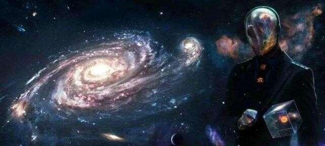

# 北京已纳入发展规划，元宇宙才是未来发展方向？

北京市政府宣布了一项为期两年的元宇宙创新发展计划，重点是促进元宇宙相关产业的发展，帮助北京建设数字经济的标杆城市。

该行动计划要求所有地区在城市一级建设技术基础设施，并促进其在包括教育和旅游在内的各个领域的使用。

北京市政府所在地通州区将主导发展规划。此前，北京分拨中心已与DAGAO国际艺术区签署合作协议，发放占地32，000平方米的元宇宙测试园区。

该开发项目将使用增强现实和虚拟现实，3D可视化和GIS（地理信息系统）等技术来构建可视化城市空间数字平台。

该公告还强调了北京培育元宇宙知识产权公司的计划，以增强该行业的生态系统。在指导下，需要几个地区提供财政和人力资源支持，以建立虚拟现实。

Metaverse（元宇宙）是一个技术术语，最初来自科幻小说作家尼尔·斯蒂芬森（Neal Stephenson）1992年的赛博朋克小说《雪崩》（Snow Crash）。该术语描述了一个包罗万象的虚拟世界，人们可以通过使用化身来玩，社交和相互交流。

在过去的几个月里，中国的两个主要城市宣布了以元宇宙和NFT为重点的多年行动计划。在北京之前，上海还将元宇宙纳入五年发展计划，根据该计划，上海市政府承诺到2025年底发展一个3500亿元人民币（约合510亿美元）的元宇宙产业。

北京对领先的Web3技术的兴趣日益浓厚，可能会导致中国更广泛地采用。此前，北京市经济和信息化局发布了一份文件，强调了在未来三年内利用Web3技术发展价值500亿元人民币（75亿美元）的虚拟人类产业的计划。
