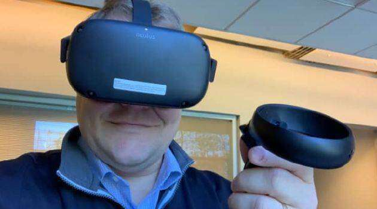

# Meta将于10月推出新款VR头显，元宇宙正快速发展

据报道，Facebook 母公司 Meta 首席执行官马克・扎克伯格（Mark Zuckerberg）透露，Meta 将在 10 月份推出新款虚拟现实头显。以往，Meta 会于 10 月份举行 Connect VR 大会。

扎克伯格表示，Meta 的下一代虚拟现实头显将提供新功能，帮助用户获得“社交存在”般的体验感。例如，新款头显将集成更多更先进的眼部和面部追踪功能。凭借这些功能，当用户在微笑或皱眉时，他们在虚拟世界中的数字人也会去做同样的表情。

Meta 近年来持续投资虚拟现实及相关技术，以推动计算技术和人机交互向虚拟现实的演进。然而，该公司可能需要很多年时间，才能收回旗下虚拟现实部门 Reality Labs 与元宇宙相关的巨额亏损。2021 年，Reality Labs 部门的营收为 22.7 亿美元，但净亏损达到 101.9 亿美元。

未来几年用户应该能够大量访问元宇宙世界，其涵盖商业、艺术、媒体、广告、医疗保健和社交协作。不仅可以通过PC、游戏机和智能型手机访问与设备无关的元宇宙，甚至也可透过VR/AR进入沉浸体验，从而形成一个庞大的生态系统。花旗银行预测到2030年，元宇宙的总潜在市场价值可能在8兆美元到13兆美元之间，元宇宙用户总数约为50亿。

随着虚拟现实技术的发展，真正地实现虚拟现实，将引起整个人类生活与发展的很大变革。人们戴上立体眼镜、数据手套等特制的传感设备，面对一种三维的模拟现实，似乎置身于一个具有三维的视觉、听觉、触觉甚至嗅觉的感觉世界，并且人与这个环境可以通过人的自然技能和相应的设施进行信息交互。

目前VR技术正处于从单点到系统、从局域到无限的升级突破阶段。VR硬件是让元宇宙虚拟空间能够被“看得见”的载体，而使虚拟空间变得具象的，则是沉浸式的、超高清的VR内容。VR与超高清是一个绝妙的组合，在VR眼镜里看到的视频内容清晰度越高、色彩还原度越真实，才会有越强的沉浸感，在元宇宙中的体验才越出色。

伦茨科技拥有自主研发无线射频和低功耗蓝牙BLE5.2芯片并具有全球知识产权，针对AIoT物联网领域和个人消费者，提供蓝牙主控全集成芯片的「软硬件共性」解决方案及核心器件，配套全方位APP软件平台定制开发。所设计的蓝牙芯片方案应用于智能穿戴设备、蓝牙室内导航、智能家居、医疗健康、运动建身、数据传输、远程控制、个人外设及AIoT物联网等场景。
