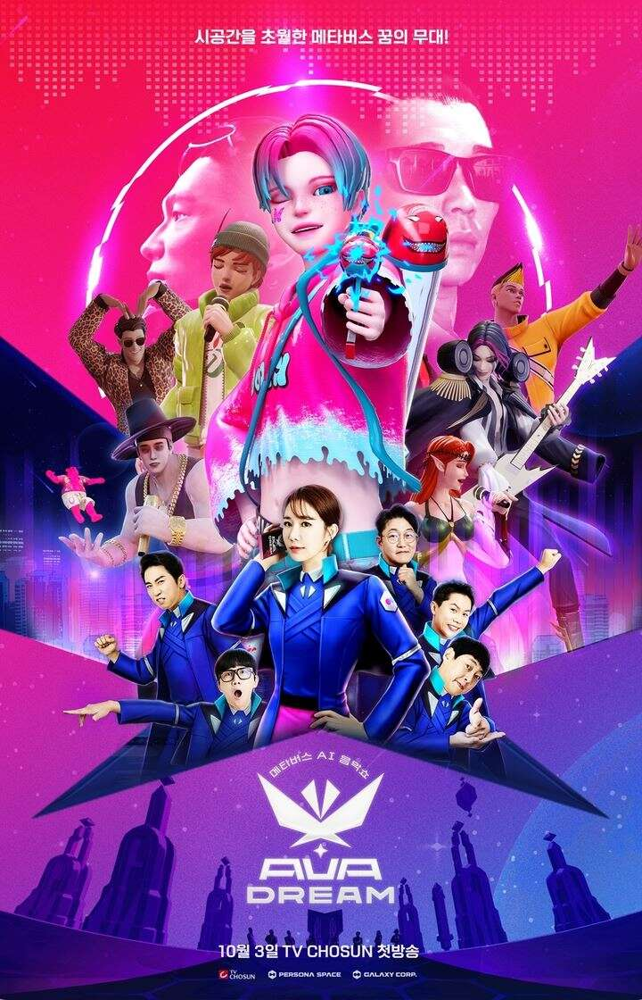

# Metaverse 进入电视业务：以虚拟形象为特色的节目，虚拟现实正在兴起

Metaverse 是指由虚拟现实和增强现实（VR、AR）技术促成的虚构、身临其境的世界，被认为是下一个科技大趋势，多年来，尤其是随着 COVID-19 大流行开启了非接触式时代。

许多行业，从游戏和社交媒体到银行和零售，都在努力实施这些技术并将元界技术融入他们的业务。扩大其影响力，metaverse 现在正在冲击电视业务，其网络运行具有相关技术的系列，如虚拟化身和 VR 或 AR。本地网络 MBN 推出了一个大预算项目“阿凡达歌手”，该项目于 8 月 26 日开始播出。

**新节目自诩为韩国首个虚拟世界音乐节目，邀请知名音乐家表演并相互竞争。**

但是有一个转折点：音乐家通过舞台上的数字化身进行表演。参赛者隐藏自己的真实身份，通过他们的虚拟化身进行表演，这些化身模仿他们的舞蹈、唱歌甚至面部表情。化身来到舞台上，在观众和一组小组演员面前表演，他们必须尝试猜测每个化身背后的艺术家。制作团队透露，这部由 15 部分组成的节目的每一集制作成本约为 10 亿韩元（717,000 美元）。

MBN音乐节目“阿凡达歌手”的场景/由MBN提供

该节目的执行制片人金允成在节目的新闻发布会上说：“作为该国第一个实现AR和VR（在节目中），是最难利用的技术之一。”上个月末。“制作中使用的技术质量非常高。我们已经开发了一年，大约有 200 名员工。我们的预算是韩国真人秀节目中最大的。”

另一个本地网络 TV Chosun 也正准备推出一个以虚拟人类为特色的新音乐节目。定于 10 月 3 日首播的“Ava Dream”采用与 MBN 节目类似的格式。它邀请了 24 位被称为梦想家的歌手，创建一个虚拟版本的自己来表演，

喜剧演员李容镇和刘世允将担任主持人，女演员刘仁娜、喜剧演员梁世亨和李镇浩以及歌手金贤哲将出演“追梦人”来猜测艺术家。

TV Chosun 音乐节目“Ava Dream”的海报/由 TV Chosun 提供 

**Metaverse 也正在进入越来越受欢迎的约会真人秀节目中。**

JTBC 于 8 月 23 日至 9 月 13 日播出的由四部分组成的真人秀节目《Love In》采用了一种相当陌生的虚拟空间约会概念。一群单身人士，每个人都被隔离在不同的房间里，通过一个头像彼此相亲三天。在不知道对方长什么样的情况下，参与者只能通过他们的虚拟自我进行交互，同时试图找到真正的联系。然而，尽管将元宇宙融入电视节目具有独特性，但这些节目的结果却令人失望，未能赢得观众的心。

《阿凡达歌手》尽管制作组在发布会上表达了激动之情，但以1.4%的收视率开场，第二集的收视率甚至跌至0.8%。

JTBC 的相亲节目也未能引起轰动，其大部分剧集的收视率极低，仅为 0.4%。流行文化评论家河在根表示，使用虚拟世界相关技术制作节目仍有许多限制。“元界本身要融入娱乐行业有几个限制。电视节目首先必须建立一个易于理解的概念，并且明星名人亲自参与一些能够引起观众共鸣的事情， “他告诉韩国时报。

“但当它开始涉及数字化、计算机相关的概念时，它变得复杂并扭曲了流程，这使得更难捕捉到观众的兴趣。而且由于技术的质量仍然没有达到最高标准，它往往会稍微降低节目的质量。”

这位评论家补充说，尽管这些节目缺乏成功，但在电视节目中采用新技术可能对网络来说是一个有意义的实验。“制作这样的节目似乎有点压倒性。但从网络的角度来看，由于他们必须继续为他们的节目尝试新事物，这是一个采用这个新关键字的实验。
