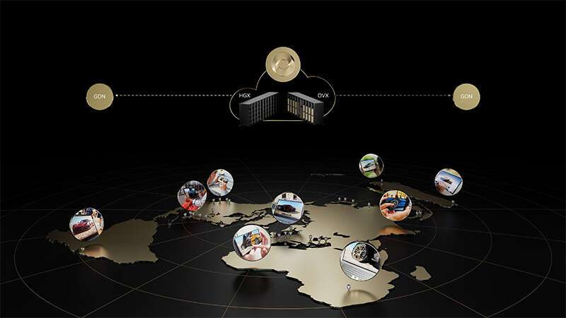

# Nvidia 推出 Omniverse Cloud 以支持工业元宇宙“数字双胞胎”

Nvidia Corp. 凭借其超逼真的物理模拟和协作产品Omniverse继续推动工业虚拟世界的边界，这是一个与真实空间平行的虚拟空间，可以模拟虚拟世界中的详细物理资产。

今天，在公司为开发者举办的虚拟 GTC 2022 会议期间，Nvidia 宣布推出Omniverse Cloud，这是一种基于云的综合软件即服务解决方案，供艺术家、开发人员和企业团队使用 Omniverse 设计、发布和运营元界应用程序在世界上任何地方。

Omniverse 是一个实时协作和模拟平台，可实现对世界的大规模真实再现。使用该平台，设计师和工程师团队可以重新创建和模拟汽车、飞机、建筑物、工厂等。引擎或工厂的所有部件都可以像现实世界一样实时设计成完全模拟的物理，以像在现实生活中一样做出反应。

这些被称为“数字双胞胎”，是真实空间和物体的完全虚拟双胞胎，是工业元宇宙的一部分。因此，可以对它们进行迭代、更改和试验，以了解在现实世界中需要进行昂贵的更改之前会发生什么。

使用 Omniverse Cloud，个人和团队将能够共同设计和协作处理工作流程，而无需本地计算能力。

英伟达创始人兼首席执行官黄仁勋表示：“3D 互联网元界连接了通用场景描述中描述的虚拟 3D 世界，并通过模拟引擎进行查看。” “借助云中的 Omniverse，我们可以连接全球团队来设计、构建和运营虚拟世界和数字双胞胎。”

Omniverse Cloud 在 Nvidia 数据中心内专门设计的云计算架构上运行，硬件运行Nvidia OVX]架构用于图形和模拟，Nvidia HGX服务器用于高级人工智能工作负载。它使用 Nvidia 图形交付网络，这是一个全球规模的分布式数据中心网络，用于交付该公司从其低延迟基于云的视频游戏流媒体服务 GeForce Now 的经验中学到的低延迟虚拟世界内容。

### 让数字双胞胎在现实世界中发挥作用

数字双胞胎的强大之处在于，它们可以非常精确地模拟虚拟世界中的现实世界，就像在虚拟世界中进行测试和可视化以及物理世界的最终确定性一样。

零售店 Lowe's 为其员工提供了 Nvidia Omniverse Enterprise 和增强现实眼镜，基本上为员工提供了 X 射线视觉。例如，传统上，为了阅读高处盒子上的小标签，员工可能需要爬梯子才能看到可用的内容。有了数字双胞胎和 AR 眼镜，他们只需抬起头，眼镜就可以显示应该在那个位置的物品的数据。

员工还可以通过将数字双胞胎的 AR 全息图与当前货架上的商品进行比较，通过眼镜查看货架上的库存是否正确——例如货架上是否有错误的产品或货架上的商品是否太少。然后他们可以纠正它。

Lowe's 首席数字和信息官 Seemantini Godbole 说：“借助 Nvidia Omniverse，我们以前所未有的方式将数据整合在一起，赋予我们的员工超能力。”

对于商店管理，它更进一步，使用数字双胞胎和人工智能商店规划师可以通过检查购物者相互购买的产品来优化客户体验。然后，通过努力将这些产品彼此靠近，检查客户步行流量的 3D 热图，员工可以将产品彼此靠近，以减少客户必须采取的步骤。

英伟达还宣布与德国铁路运营商 Deutsche Bahn 的数字部门 Digitale Schiene Deutschland 合作，后者开始在不建造新轨道的情况下扩大网络容量。这项工作需要一个安全的自动化列车系统，彼此之间的距离更短，并且将涉及建立第一个国家规模的整个轨道网络的数字孪生模拟。

由于它将涉及对整个轨道系统进行逼真且物理上精确的模拟，因此这将是一项艰巨的任务。它还将包括穿过城市和乡村的轨道以及来自包括站台测量和车辆传感器在内的许多来源的数据。

使用内置于 Omniverse 中的整个网络的数字双胞胎，它与实际铁路网络同时运行，实时输入相同的数据，它将能够使用 AI 来监控传感器和其他数据以及模拟来预测和防止事故发生。

“借助 Nvidia 技术，我们能够开始实现全自动火车网络的愿景，”德国铁路公司旗下 DB Netz 的 Lead Perception Group 的 Ruben Schilling 说。
