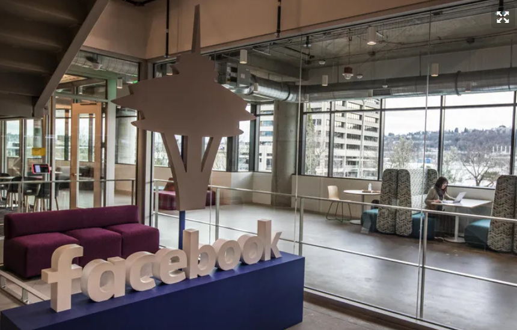

# Meta 西雅图地区办公室的新负责人正在通往元宇宙的路上

Paresh Rajwat 和他在 Facebook 母公司 Meta Platforms 的工程师团队正在努力将人们带出二维互联网，进入一个虚拟世界，用户可以在那里聊天、购物和下棋，有时与半个地球以外的人一起。

Rajwat 说，通往那里的道路“经过西雅图”。

Puget Sound 拥有 8,000 多名员工，是 Meta 在其加利福尼亚州门洛帕克总部以外的最大枢纽。这里的工程师正在研究 Meta 的产品，从 Facebook 市场到在虚拟现实中运行的化身，当然还有元宇宙。

上周，Meta 任命已经担任产品管理副总裁的 Rajwat 为太平洋西北地区办公室负责人。他在公司工作了 8 年，致力于 Facebook 应用的货币化，利用创作者经济并监督视频团队。在 Meta 之前，Rajwat 曾在微软、苹果、雅虎和广告公司 Criteo 工作。

现在，他专注于维护 Meta 的工作场所文化，将公司与西雅图社区联系起来，领导 Meta 的虚拟现实工作并监督 Metaverse 中的新功能。

Rajwat 将元宇宙描述为“实体互联网”。他说，在里面，你可能会听到从你右侧传来的声音，然后转身看到一个人的化身，他实际上坐在几英里外，但感觉就在你旁边。“它无视距离，”他说。“它真的可以帮助人们建立联系。”

目前，虚拟世界和物理世界之间仍然存在一堵“大墙”，Rajwat 预计虚拟世界完全推出还需要很长时间。当这种情况发生时，可能会有不止一个元宇宙，这意味着元已准备好面对竞争。但 Rajwat 希望用户能够在他们之间快速移动。

在短期内，Meta 的工程团队正在努力为目前存在的元世界添加功能，例如在虚拟世界中进行支付的方式或向尚未连接到元世界的人发送消息的能力。

“Meta 有一个关于连接世界的东西，”Rajwat 说。他继续说，它已经专注于 Facebook、Instagram、WhatsApp 及其 Messenger 应用程序。现在，它正在考虑社交网络的未来。

“我们想得越多，我们就越总是得出同样的结论。......这有点像元宇宙，”Rajwat 说。

在它成为今天的主宰之前，Meta（当时称为 Facebook）于 2010 年在西雅图开设了商店，当时只有少数工程师。它在派克市场附近的办公室成为它在硅谷总部以外的第一个工程中心。在那里，工程师们正在研究 Skype 视频聊天功能、位置登记服务和自动显示在移动设备上运行良好的 Facebook 版本的转换器。

从那时起，Meta 扩展到更大的位置，然后在西雅图市区以外的地区发展，在雷德蒙德和贝尔维尤设有办事处。2020 年，它以近 3.68 亿美元的价格收购了 REI 从未使用过的贝尔维尤校区，在其春区校区的基础上，该校区已经发展到包括 850,000 平方英尺的办公空间。

当时，该公司告诉《西雅图时报》，它在普吉特海湾有大约 5,000 名员工。现在，两年后，它说它有8,000多个。

但这种增长被搁置了。9 月，Meta 宣布将在公司历史上首次冻结招聘、重组团队并减少员工人数。首席执行官马克扎克伯格告诉员工，2023 年 Meta 的规模将比今年小。

“我曾希望经济现在会更加明显地稳定下来，”他在全公司范围内的电话会议上说。“但从我们所看到的情况来看，它似乎还没有，所以我们想保守地计划一下。”

Meta拒绝评论招聘冻结和裁员将如何影响其在太平洋西北部的劳动力。

Rajwat 上周在接受采访时表示，Meta 将继续接受远程工作，允许员工选择他们想在办公室工作的天数——以及他们是否想来办公室。

“现在我们必须把工作带给人们，而不是让人们上班，”他说。而且，当然，Meta 正在开发它希望能够让远程工作感觉就像你亲临现场的工具。 
