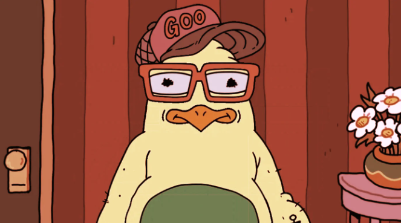

# “瑞克与莫蒂”创作者的艺术巨匠重新辩论 NFT 影响者道德

Art Gobblers 是 Justin Roiland 的一个以太坊 NFT 项目。图片：艺术酒鬼

[NFT](https://decrypt.co/resources/non-fungible-tokens-nfts-explained-guide-learn-blockchain)世界今天因周一推出的Art Gobblers而热闹非凡，这是一个基于以太坊的项目，来自“Rick & Morty”的联合创始人 Justin Roiland 和加密投资公司 Paradigm。在昨晚的免费[NFT铸币之后，Art Gobblers 已经产生了价值超过 2600 万美元的二次销售根据][CryptoSlam），这表明围绕该项目进行了巨大的炒作。

但围绕 Crypto Twitter 的讨论并不仅仅集中在交易需求水平、今天的艺术品展示，甚至是该项目的新颖方法——它允许用户将自己的艺术品铸造为 Page NFT，并交易“Goo”代币以产生更多 NFT。

相反，过去一天围绕 Art Gobblers 的大部分讨论都围绕着著名的 NFT 影响者在社交媒体上的作用——包括他们是否得到了免费且最终有价值的 NFT 的补偿，以及他们是否正在推动一个拥有强大声音的系统在没有适当披露的情况下利用他们的平台。

Art Gobblers 昨天推出了 1,700 个 Gobbler 艺术品 NFT，任何被添加到批准的许可名单中的人都可以免费铸造这些 NFT。另外 300 个 NFT 预留给项目创建者和贡献者，另外 8,000 个 Gobbler NFT 将在未来 10 年内逐步发布。

此后不久，NFT 开始通过二级市场大笔出售，目前最便宜的 NFT 上市价格为 14.5 ETH，约合 22,850 美元。周一晚上，一个 NFT 卖出了价值近 138,000 美元的 ETH。

在二次销售激增的情况下，Crypto Twitter 点亮了病毒式推文，分享了著名的 NFT 影响者、内容创建者和成功铸造其中一个 NFT 的人物的名单。总的来说，最初的反应是负面的，一些用户声称这反映了拥有大量受众的影响者获得的巨大利益。

该名单包括广受关注的 Twitter 人物，如 Rug Radio 联合创始人Farokh Sarmad、化名收藏家和创作者Fxnction、频繁的 Twitter Spaces 主持人和 Devotion 联合创始人Andrew Wang，以及化名影响者和内容创作者Zeneca。

“这就是 NFT 永远不会被认真对待的原因，”著名的匿名影响者 ShiLLin_ViLLian在推特上写道。来自其他 Twitter 用户的投诉有时不那么友好，因为一些人声称，流行的 NFT 收藏者有付费游戏协议，可以炒作该项目以换取许可名单，但没有明确披露。

## **瓦格米？**

直言不讳的收藏家和创作者被指控用炒作和促销来换取具有潜在价值的 NFT 已经不是第一次了。通常，当 NFT 项目启动并且价格飙升时，Twitter 用户会指出从许可名单中铸造的影响者，特别是如果他们立即出售 - 换句话说，就是拉高出货。

此类指控并不总是有证据支持。然而，拥有社会资本的 NFT 收藏家正在利用他们的影响力从项目中个人受益的看法与所谓的WAGMI（“我们都会成功”）在Web3中所有人平等的精神背道而驰。Art Gobblers 周围的刻薄程度表明这种看法仍然存在。

如果这些影响者和收藏家真的参与了这样的交流——无论是围绕 Art Gobblers 还是其他项目——那么他们通常不会公开披露此类协议。由于该领域的许多著名收藏家都是化名的，而且追随者可能不知道他们的真实姓名或背景，这使情况变得更加复杂。

根据联邦贸易委员会 (FTC) 的规定，社交媒体影响者必须明确披露在美国的付费代言。与此同时，正如金卡戴珊最近发现的那样，推广加密货币和相关产品的名人和影响者正越来越多地面临美国证券交易委员会的审查和惩罚。

根据来自 Art Gobblers 的9 月推文，创作者选择“亲自挑选”艺术家和 Web3 建设者来铸造 NFT，他们反过来也提名其他人加入名单。一些铸币者在推特上表示，他们仅仅通过参与该项目的 Discord 服务器就获得了访问权限。*Decrypt*就任何潜在的影响者协议与 Art Gobblers 联系，但我们在发布时没有收到回复。

Wang 之前主持了对 Roiland 的 Twitter Space 采访，并在最后一天发布了大量关于他参与 Art Gobblers 和反弹的推文。他透露，他在推特上经营了一个基于虚构人物的“Art Gobblers 官方账户”，直到今天才被披露。

即便如此，Wang 今天告诉*Decrypt*，“没有达成协议以换取许可名单的位置进行推广。” 截至发稿时，Sarmad 和 Zeneca 没有回复*Decrypt*的置评请求。

## **“翻转”襟翼**

Fxnction 是那些立即翻转并出售他的 Art Gobblers NFT 的影响者中唯一一个；其他人的钱包里仍然有他们的 NFT。昨晚他在推特上发布了关于此举的消息：“我得到了那个狗屎并迅速将其扔掉。免费 18,000 美元。你期待不同？”

他今天告诉*Decrypt*，他没有在发布前宣传或发布有关 Art Gobblers 的推文，并声称他是通过提前加入 Discord 服务器而进入许可名单的。他还评论了这种强烈反对，区分了那些利用他们的观众来推动他们相信的项目的人，以及那些在大肆炒作 NFT 下降后兑现的人。

Fxnction 说：“我认为 [人们] 可以用他们的资产做任何他们想做的事情，即使他们是通过拥有追随者来获得资产的。” “话虽如此，如果有人积极先令并推动它，那么它就变成了一条细线，然后就退出了。这就是社区争议开始的地方（可以理解）。”

如果 Fxnction 和其他铸币者在炒作之前通过参与获得了 Art Gobblers 许可名单的访问权，那么它可能发生在任何人身上——对吧？这就是 Web3 的理想，项目的早期支持者会随着时间的推移而受益，尽管仍然有很多人怀疑影响者会受到优待，希望能引起更多的兴趣。

自昨晚的交易狂潮以来，一些敌意已经平息，其他收藏家和创作者为那些因铸造 NFT 而成为目标的人辩护。例如，化名 Web3 的创建者 Loopify指出了所谓的“错误信息”，并分享了来自铸币者的匿名信息，这些铸币者说出售 NFT 给他们带来了改变生活的钱。

Fxnction 向*Decrypt*建议，创作者有空间更好地规范许可名单并避免将来出现这种反弹……但任何对此感到不满的人都应该早点注意到。

“[你]真的可以为这种[类型]的东西制定规则，因为我看到[很多人]不断推动，”他说。“这是 Web3。如果你足够早地关注，任何人都可以抓住[白名单]。”
