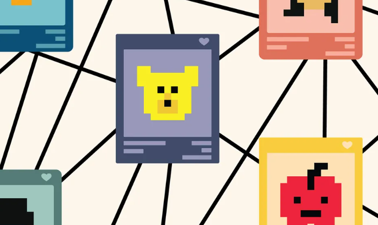

# 为什么 NFT 艺术家不应该期待“版税”

经过数月的沉寂，最大的不可替代代币交易所 OpenSea 宣布在向 NFT 创造者支付的“版税”上采取中间道路。此举可能会重塑关于这些数字资产是否应该在转售时自动支付“创作者费用”（这有利于艺术家）或完全取消该标准（这对交易者来说更好）的[争论。](https://www.coindesk.com/web3/2022/11/04/retract-royalties-reduce-revenue-nft-creators-are-suffering-and-so-are-marketplaces/)

OpenSea 的新“链上执行”工具本质上是 NFT 创建者在构建智能合约时可以添加的代码片段，这将确保他们在每次 NFT 易手时都能继续获得收益分成。这与 X2Y2、LooksRare 和 SudoSwap 等市场的趋势背道而驰，这些市场已经消除或最小化了版税系统。

正如 OpenSea 首席执行官 Devin Finzer[在随附的博客中](https://future.com/nfts-thousand-true-fans/)[所写](https://opensea.io/blog/announcements/on-creator-fees/)，当 NFT 标准于 2018 年推出时，版税被宣传为一种使新一类创作者受益的方式，否则他们将被剥夺其工作不断增长的价值。但是，和现在一样，没有任何实际的机制可以确保这种形式的持续补偿会发生。

OpenSea 和其他早期上市的 NFT 交易所引入了“创作者费用”，试图吸引建造者加入该行业。它开始了 NFT 价值主张的核心部分：你只需要听到这么多关于随着作品价值增加而挨饿的艺术家的说法，就能明白为什么在二级市场支付的版税会很有吸引力。

时尚品牌 The Hundreds 的联合创始人 Bobby “Bobby Hundreds” Kim在 Twitter 上[说：](https://twitter.com/bobbyhundreds/status/1589308108295516160) “到目前为止，这项卓越技术的主要论点一直是确保艺术家的作品获得报酬。” 然而，这篇论文在很大程度上依赖于交易所来执行它（以及买家的好意，没有找到绕过它的方法）。

从今年夏天开始，几家 NFT 交易所开始削减版税或将其视为买家可以支付的可选小费。这显然[激怒了](https://thedefiant.io/looksrare-drops-royalty-fees)几位开始依赖收入流的 NFT 艺术家，尤其是考虑到市场低迷。消除或缩减特许权使用费有利于交易所，也受到熊市交易量减少和买家的影响。

虽然 Bobby Hundreds 说“放弃创作者版税会放弃 Web3/NFT 的整个使命”可能是正确的，但此举本身可以被视为对该行业有益。

首先，如前所述，NFT 不会以编程方式向其原始创建者支付费用（尽管如果愿意，它们可以升级为这样做）。通过将小费设为可选，交流与实际技术而非文化期望保持一致。以虚假的名义创建或出售 NFT 是不好的，而让版税 100% 起作用的唯一方法是需要每个人都同意。

其次，NFT 是一种通用技术，具有多种功能。向 Ticketmaster 这样的公司支付 5%-10% 的费用，如果他们及时采用这项技术，似乎很恶心。NFT 制造商和市场参与者有多种类型。以微薄利润经营并移动价格底线的贸易商已经在寻找特许权使用费的解决方法。

艺术家们抵制了一些远离版税的交易。[例如，据 Decrypt报道](https://decrypt.co/113698/opensea-breaks-silence-on-nft-royalties-but-creators-dont-like-what-they-hear)，X2YX 的交易量从 8 月 26 日的 11,540 ETH 下降到 547 ETH 。“一个月前，大约 75% 的 NFT 买家选择在 [X2Y2] 上支付版税，如果有选择的话，”Punk 9059[发推](https://twitter.com/punk9059/status/1586085941390635008)文说。“现在这个数字大约是 18%。”

OpenSea 的新工具使新 NFT 集合的创建者更容易将非版税交易列入黑名单。有人称这一举动是反竞争的。这当然是自私自利的，也是一种让自己深受 NFT 艺术社区喜爱的方式。但考虑到 NFT 背后的实际技术，这似乎是一个实用的解决方案。

“在我们看来，到目前为止，更好的选择是现有创作者探索新的货币化形式和激励买卖双方支付创作者费用的替代方式，并确保未来的收藏在链上强制执行创作者费用，”Finzer， OpenSea 首席执行官写道。交易所也可以创建激励小费的系统——比如 Blur 的代币[空投](https://dune.com/sealaunch/blur)给付款人。

（OpenSea 的新收藏或可编辑收藏的链上系统将于 11 月 8 日生效。它将决定是否将该工具扩展到现有收藏，并在 12 月 8 日之前接受社区反馈。）

尽管对于无限期创作者收费有强烈的论据，但艺术家依靠交易所来兑现这一制度总是不可持续的。该行业应该培养一种可以给小费的文化。但除非将其写入代码，否则任何人都不应该期望这些规则会得到执行。这就是加密货币一直以来的意义所在。
