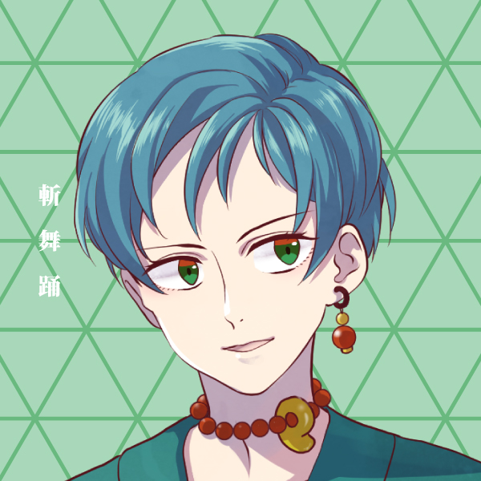

# KOJIPRO-GODz

日本最古老的史书《古事记》。

这本书创作于 1300 年前，是一本严肃的书，描述了从日本神话到公元 600 年左右的历史。

……我是这么想的，但这实际上是一个混乱的故事！

毫不夸张地说，它是日本引以为豪的漫画、动漫和游戏的发源地。

作为本项目的母体的Kojiki项目，是以Kojiki和日本本土神话为基础，创作音乐、声乐、漫画、舞台表演等娱乐作品的创作团队。

成立于2017年。

有其他主业的创作者聚集起来，站成一个圈。

为了向世界广泛传播神话和神社等日本文化作为娱乐作品，我们致力于创作自己的作品。

在继续稳步创作作品的同时，我们在 2019 年成为了与声优事务所和神社签订合同的法人。

在将作品获得的利润返还给大家的同时，其余的将毫不犹豫地全部投入到下一部作品的制作中。

除了音乐和声乐剧，2021年终于要上演了。

Kojiki 项目是一个 10 人的团队，他们每天都热衷于创作像文化节一样的作品，就像 DAO 的原型一样。

Kojiki 项目仍然不为人所知。

为了将我们的工作传播到世界各地，实现新的梦想，我们一直在寻找新的可能性。

大约在去年左右，全球高度敏感的人开始对 NFT、web3 和 DAO 产生兴趣。 Kojiki 项目的代表村上隆在学习的同时对 NFT 产生了兴趣，并坚信这个世界上有一条出路，并在今年实际参与了几个 DAO。

在那个世界里，显然有一个创造者得到回报的世界，有一些东西让我觉得 Kojiki 项目充满了实现梦想的可能性。

在这个创作者和演员每天都无法获得正确报酬的世界里，创作者在日本是不被允许谈论金钱的。我认为我可以在 NFT 和 web3 的世界中改变这一点，所以我希望启动 NFT 项目。

某天，部分参与 DAO 的代表村上隆碰巧与他的老朋友佐藤锐律师团聚。

虽然佐藤作为律师和个人都涉足加密资产、NFT 和元界，但他坚信 WEB 3.0 会在不久的将来变得司空见惯。到神社。

目前，据说日本大约有8万座神社，根据一种理论，其中约90%的神社都受到仪式管理的影响。

有的神社是一名司祭负责几个公司，也有许多没有管理员的无人神社。

因此，为了开辟一条改善在仪式管理中苦苦挣扎的神社管理的路径，选择了 NFT / Metaverse 作为一种方法。我以为Kemigawa Shrine会带头并付诸实践。

三个人，有着相同的目标，决定开始一个结合他们计划的项目。

利用日本引以为豪的动漫和漫画的力量，我们启动了 Kojiki 项目 Crypt!，这是一个向世界传播日本神话和神社文化的项目。

