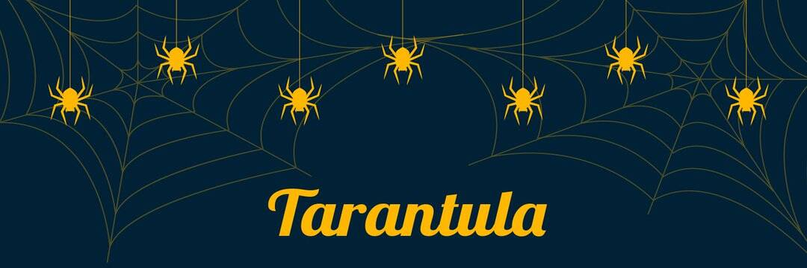

# Tarantula

狼蛛因为它们大而多毛的身体和腿让一些人毛骨悚然。但是这些蜘蛛对人类是无害的（除了咬伤），它们的温和毒液比典型的蜜蜂要弱。在蛛形纲动物爱好者中，这些蜘蛛已成为流行的宠物。

蜕皮
狼蛛周期性地在一个称为蜕皮的过程中脱落它们的外部骨骼。在此过程中，它们还会替换内脏器官，例如女性生殖器和胃内膜，甚至重新长出丢失的附肢。

栖息地
在世界大部分热带、亚热带和干旱地区发现了数百种狼蛛。它们的颜色和行为因特定环境而异。然而，一般来说，狼蛛是生活在地下的穴居动物。

打猎
狼蛛是缓慢而有意识的移动者，但擅长夜间捕食者。昆虫是它们的主要猎物，但它们也以更大的猎物为目标，包括青蛙、蟾蜍和老鼠。顾名思义，南美食鸟蜘蛛甚至能够捕食小型鸟类。

狼蛛不会用网来诱捕猎物，尽管当有东西接近它的洞穴时，它可能会旋转绊线以发出警报。这些蜘蛛用它们的附肢抓取，注入麻痹毒液，并用它们的尖牙消灭不幸的受害者。它们还分泌消化酶来液化受害者的身体，这样它们就可以通过它们像稻草一样的嘴巴把它们吸进去。一顿大餐后，狼蛛可能一个月都不需要吃东西。

